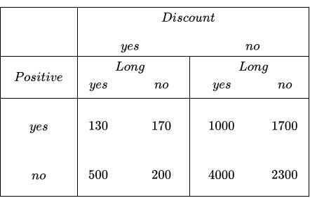
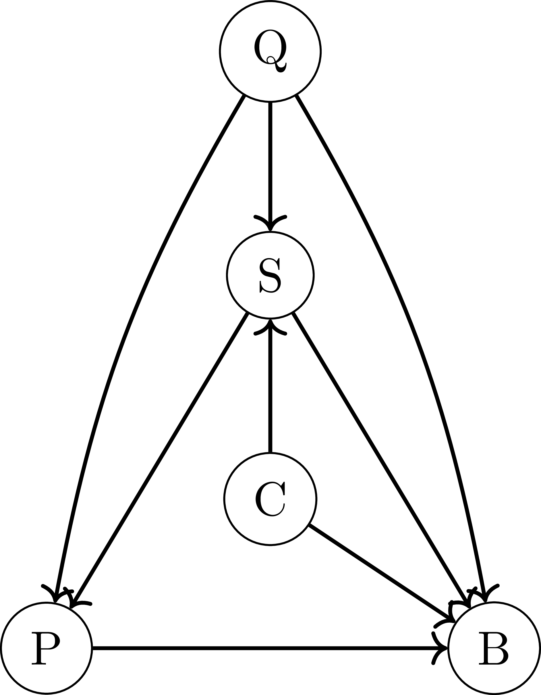
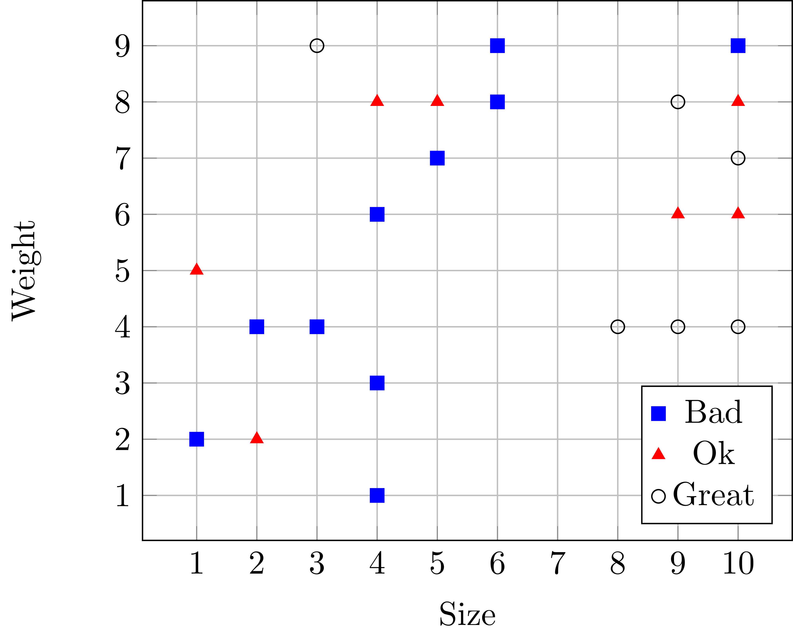
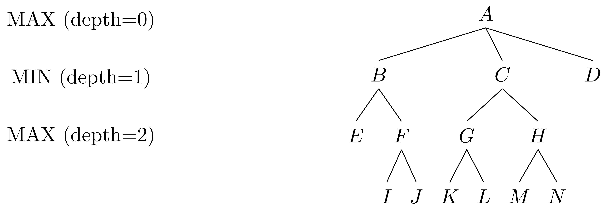
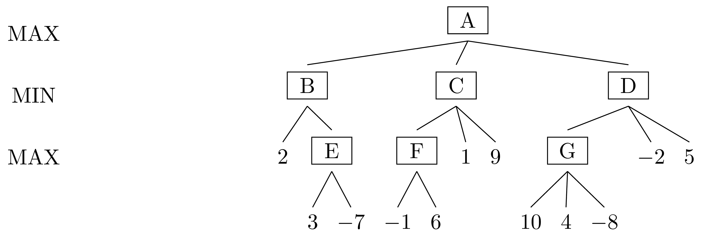
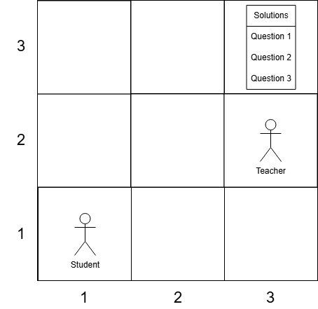
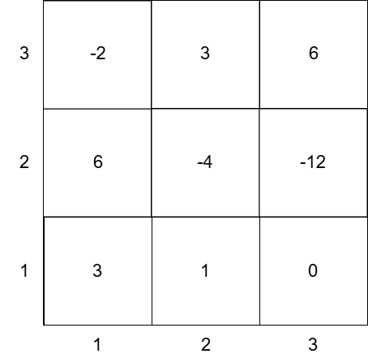

# MI Exercises - Organized by Chapter

---

# Chapter 1: Agents

## Agent Environment Classification

### Question

Classify the following domains according to their environment properties:

**Domains:**
1. Poker (Group playing poker)
2. Car Driving (Person driving a car)
3. Machine Detecting Underweight Chocolate Bars
4. Doctor Performing Medical Diagnosis

**Properties to classify:**
- Observable (Fully / Partially)
- Deterministic (vs Stochastic)
- Episodic (vs Sequential)
- Static (vs Dynamic)
- Discrete (vs Continuous)
- Single-agent (vs Multi-agent)

---

### Solution

#### Property Definitions

**1. Observable (Fully vs Partially)**
- **Fully Observable:** Agent has access to complete state of environment at all times
- **Partially Observable:** Agent has incomplete/limited information about state

**2. Deterministic vs Stochastic**
- **Deterministic:** Next state is completely determined by current state and action
- **Stochastic:** Next state involves randomness/uncertainty

**3. Episodic vs Sequential**
- **Episodic:** Each action/episode is independent
- **Sequential:** Current decisions affect future states/decisions

**4. Static vs Dynamic**
- **Static:** Environment doesn't change while agent is thinking
- **Dynamic:** Environment changes while agent deliberates

**5. Discrete vs Continuous**
- **Discrete:** Finite/countable number of states and actions
- **Continuous:** Infinite range of possible states/actions

**6. Single-agent vs Multi-agent**
- **Single-agent:** Only one agent making decisions
- **Multi-agent:** Multiple agents interact

---

#### Domain Classifications

**Domain 1: Poker (Group playing poker)**


| Property | Answer | Reasoning |
|----------|--------|-----------|
| Observable | **No** (Partial) | Cannot see other players' cards - hidden information |
| Deterministic | **No** (Stochastic) | Card shuffling is random, outcomes uncertain |
| Episodic | **No** (Sequential) | Betting decisions affect future rounds, bluffing has consequences |
| Static | **Yes** | Game state doesn't change while you're thinking about your move |
| Discrete | **Yes** | Finite number of cards, finite betting amounts (usually) |
| Single-agent | **No** (Multi-agent) | Multiple players competing against each other |

**Domain 2: Car Driving (Person driving a car)**


| Property | Answer | Reasoning |
|----------|--------|-----------|
| Observable | **No** (Partial) | Can't see around corners, behind obstacles, other drivers' intentions |
| Deterministic | **No** (Stochastic) | Other drivers unpredictable, road conditions vary, mechanical uncertainty |
| Episodic | **No** (Sequential) | Current driving decisions affect future position and safety |
| Static | **No** (Dynamic) | Traffic, pedestrians, signals change while you're driving |
| Discrete | **No** (Continuous) | Speed, steering angle, position are continuous values |
| Single-agent | **No** (Multi-agent) | Many other drivers on the road |

**Domain 3: Machine Detecting Underweight Chocolate Bars**


| Property | Answer | Reasoning |
|----------|--------|-----------|
| Observable | **Yes** (Fully) | Can measure weight directly with sensor |
| Deterministic | **Yes/No** | Depends on sensor reliability. Often considered deterministic for ideal sensor |
| Episodic | **Yes** | Each chocolate bar measurement is independent |
| Static | **Yes** | Chocolate bar doesn't change while being weighed |
| Discrete | **No** (Continuous) | Weight is a continuous measurement |
| Single-agent | **Yes** | Only one machine, no other agents involved |

**Domain 4: Doctor Performing Medical Diagnosis**


| Property | Answer | Reasoning |
|----------|--------|-----------|
| Observable | **No** (Partial) | Cannot directly observe internal conditions, relies on symptoms/tests |
| Deterministic | **No** (Stochastic) | Same symptoms can indicate different diseases, test results have uncertainty |
| Episodic | **No** (Sequential) | Treatment decisions affect patient's future state and health |
| Static | **No** (Dynamic) | Patient's condition can change during diagnosis/treatment |
| Discrete | **No** (Continuous) | Many measurements are continuous (temperature, blood pressure, etc.) |
| Single-agent | **Yes/No** | Usually single doctor making decisions (yes), but could involve patient cooperation |

**Note:** Some classifications can be debated depending on assumptions. The chocolate machine's "Deterministic" depends on sensor quality - perfect sensor = deterministic, noisy sensor = stochastic. Doctor's "Single-agent" depends on whether you consider the patient as another agent.


---

# Chapter 2: Constraint Satisfaction Problems (CSP)

## Arc Consistency on a Constraint Network

This task involves applying the Generalized Arc Consistency (GAC) algorithm to the constraint network γ = (V, D, C):

### Problem Statement

- **Variables**:  
  V = {a, b, c, d}
- **Domains**:  
  For all v ∈ V: Dv = {1, 2, 3, 4, 5}
- **Constraints**:  
  - a + 2 < d  
  - b × d < 6  
  - a + c < 6

Your task: **Run the Generalized Arc Consistency algorithm** on this constraint network. After enforcing GAC, what are the possible values (domains) for each variable?

---

### Solution

Let's enforce GAC on each constraint step by step.

#### 1. Constraint: a + 2 < d

For each possible a ∈ {1,2,3,4,5}, determine possible d ∈ {1,2,3,4,5} such that a + 2 < d.
- a = 1 ⇒ 1+2=3<d ⇒ d∈{4,5}
- a = 2 ⇒ 2+2=4<d ⇒ d=5
- a = 3 ⇒ 3+2=5<d ⇒ d>5 ⇒ d=∅ (no solution)
- a = 4 ⇒ 4+2=6<d ⇒ d>6 ⇒ d=∅
- a = 5 ⇒ 5+2=7<d ⇒ d>7 ⇒ d=∅

So **a ∈ {1,2}**. Corresponding feasible d (due to this constraint):
- For a=1 ⇒ d∈{4,5}
- For a=2 ⇒ d=5

Therefore, for this constraint, **d∈{4,5}**.

#### 2. Constraint: b × d < 6

Original: b, d ∈ {1,2,3,4,5}. Update d to {4,5} (from above):

Check for each b ∈ {1,2,3,4,5} and d∈{4,5}:
- d=4:
  - b=1: 1×4=4<6 ✔️
  - b=2: 2×4=8 ✗
  - b=3: 3×4=12 ✗
  - b=4: 4×4=16 ✗
  - b=5: 5×4=20 ✗
- d=5:
  - b=1: 1×5=5<6 ✔️
  - b=2: 2×5=10 ✗
  - b=3: 3×5=15 ✗
  - b=4: 4×5=20 ✗
  - b=5: 5×5=25 ✗

So, for both d=4 and d=5, only **b=1** is possible.  
Thus, **b = {1}**

#### 3. Constraint: a + c < 6

Recall a = {1,2}

- For a=1:
  - 1+c<6 ⇒ c<5 ⇒ c∈{1,2,3,4}
- For a=2:
  - 2+c<6 ⇒ c<4 ⇒ c∈{1,2,3}

So, possible c are those that work for at least one a:
- For a=1: c∈{1,2,3,4}
- For a=2: c∈{1,2,3}

But GAC means for every remaining c, there must exist a compatible a as well.
- c=1: (a=1 or a=2)
- c=2: (a=1 or a=2)
- c=3: (a=1 or a=2)
- c=4: (only a=1)

So c∈{1,2,3,4}

### **Final Domains after GAC:**

- **a = {1, 2}**
- **b = {1}**
- **c = {1, 2, 3, 4}**
- **d = {4, 5}**

---

## Additional CSP Practice Problems

### Problem 2.4: Domain Reduction

**Question:** Apply GAC to:

Variables: {X, Y, Z}  
Domains: X ∈ {1,2,3}, Y ∈ {1,2,3}, Z ∈ {1,2,3}  
Constraints:
- X < Y
- Y < Z
- X + Z ≤ 4

**Solution:**

**Step 1: X < Y**
- X can be 1,2 (not 3, as Y would have no valid value > 3)
- Y can be 2,3 (not 1, as no X < 1)

**Step 2: Y < Z**
- Y can be 1,2 (not 3, as Z would have no valid value > 3)
- Combined with previous: Y ∈ {2}
- Z ∈ {3} (must be > Y=2)

**Step 3: X + Z ≤ 4**
- Z = 3, so X ≤ 1
- Combined with X ∈ {1,2}: X = 1

**Final domains:**
- **X = {1}**
- **Y = {2}**
- **Z = {3}**

**Valid solution:** (1, 2, 3)

---

### Problem 2.5: Arc Consistency

**Question:** Given constraint X + Y = 5 with:
- X ∈ {1, 2, 3, 4}
- Y ∈ {1, 2, 3, 4}

What are domains after arc consistency?

**Solution:**

**For arc (X, Y):** For each X, must have Y = 5-X
- X=1 → Y=4 ✓
- X=2 → Y=3 ✓
- X=3 → Y=2 ✓
- X=4 → Y=1 ✓

**For arc (Y, X):** Same analysis

**Final domains:**
- **X ∈ {1, 2, 3, 4}** (all have support)
- **Y ∈ {1, 2, 3, 4}** (all have support)

No pruning needed - all values have support.

---

### Problem 2.6: Multiple Constraints

**Question:** Variables A, B ∈ {1,2,3,4,5}

Constraints:
- A > B
- A + B > 7

After GAC, what are valid domains?

**Solution:**

**Analyze A + B > 7:**
Valid pairs: (3,5), (4,4), (4,5), (5,3), (5,4), (5,5) and more...

**Add constraint A > B:**
Must have A > B AND A + B > 7:
- (4,4): 4>4? NO
- (5,3): 5>3? YES, 5+3=8>7? YES ✓
- (5,4): 5>4? YES, 5+4=9>7? YES ✓
- (4,5): 4>5? NO
- etc.

Valid pairs: (5,3), (5,4), (4,3), etc.

**Final domains:**
- **A ∈ {4, 5}**
- **B ∈ {1, 2, 3, 4}**

(More specific: A=4→B∈{1,2,3}, A=5→B∈{1,2,3,4})

---

## GAC Example with 5 Variables

### Problem Definition

**Constraint Network:**  
γ = (V, D, C)

- **Variables:** V = {a, b, c, d, e}
- **Domains:** For all v ∈ V: Dv = {1, 2, 3, 4, 5, 6}
- **Constraints:**
  - a + d > 8
  - 4e – 2b < 3
  - c + 2 > a
  - b < d

### Task

1. **Run the Generalized Arc Consistency (GAC) algorithm** on the above constraint network.
2. **Select the valid To-do Arcs** for the first iteration of the GAC algorithm.
3. **List the pruned domains** of all variables after enforcing GAC.

---

### Solution

#### Step 1: Represent each constraint as arcs

The binary constraints induce the following arcs (in both directions for a binary constraint):

- a + d > 8 ⇒ (a, d), (d, a)
- b < d     ⇒ (b, d), (d, b)
- c + 2 > a ⇒ (c, a), (a, c)
- 4e – 2b < 3 ⇒ (e, b), (b, e)

Thus, the initial To-Do list of arcs (all arcs affected by some constraint):

- (a, d), (d, a)
- (b, d), (d, b)
- (c, a), (a, c)
- (e, b), (b, e)

#### Step 2: Valid To-Do Arcs for First Iteration

From the options given, the correct set for the initial to-do list is:

> (a, d), (d, a), (b, d), (d, b), (a, c), (c, a), (e, b), (b, e)

This matches the set in the option:
> (e, b), (d, b), (d, a), (c, a), (b, e), (b, d), (a, d), (a, c)

#### Step 3: Run GAC and Prune Domains

##### 1. **Constraint:** a + d > 8  
Possible values:  
Both a and d range from 1 to 6.

It turns out, the pairs for which a + d > 8 are:
- (3,6)
- (4,5), (4,6)
- (5,4), (5,5), (5,6)
- (6,3), (6,4), (6,5), (6,6)

**Therefore:**
- a ∈ {3,4,5,6}
- d ∈ {3,4,5,6}

##### 2. **Constraint**: 4e – 2b < 3  

Test for e = 1:
4×1 – 2b < 3 ⇒ 4 – 2b < 3 ⇒ –2b < –1 ⇒ b > 0.5

So, b ∈ {1,2,3,4,5,6}

e = 2:
4×2 – 2b < 3 ⇒ 8 – 2b < 3 ⇒ –2b < –5 ⇒ b > 2.5 ⇒ b ∈ {3,4,5,6}

e = 3:
4×3 – 2b < 3 ⇒ 12 – 2b < 3 ⇒ –2b < –9 ⇒ b > 4.5 ⇒ b ∈ {5,6}

e = 4:
16 – 2b < 3 ⇒ –2b < –13 ⇒ b > 6.5 ⇒ b ∈ {} (empty)

Therefore,
- e ∈ {1,2,3}

##### 3. **Constraint:** c + 2 > a  
For pruned a ∈ {3,4,5,6}, so c > a – 2

For a = 3: c > 1 ⇒ c ∈ {2,3,4,5,6}
a = 4: c > 2 ⇒ c ∈ {3,4,5,6}
a = 5: c > 3 ⇒ c ∈ {4,5,6}
a = 6: c > 4 ⇒ c ∈ {5,6}

So union over a ∈ {3,4,5,6} = c ∈ {2,3,4,5,6}

##### 4. **Constraint:** b < d  
d ∈ {3,4,5,6}; b ∈ ?

b must be less than at least one value of d. So possible b ∈ {1,2,3,4,5}

### Summary Table


| Variable | Final Domain       |
|----------|-------------------|
|   a      | 3, 4, 5, 6        |
|   b      | 1, 2, 3, 4, 5     |
|   c      | 2, 3, 4, 5, 6     |
|   d      | 3, 4, 5, 6        |
|   e      | 1, 2, 3           |

---

## GAC Example with Equality Constraints

### Constraint Network

**Variables:**  
V = {a, b, c, d}

**Domains:**  
D_v = {1, 2, 3} for all v in V

**Constraints:**  
- b = a  
- b > c  
- a ≠ c  
- c ≠ d  
- d ≤ a  

---

### Task

**Run the Generalized Arc Consistency (GAC) algorithm** on this network.

Determine the resulting domains for each variable.

---

### Solution

#### 1. **Initial Domains**
- a ∈ {1, 2, 3}
- b ∈ {1, 2, 3}
- c ∈ {1, 2, 3}
- d ∈ {1, 2, 3}

---

#### 2. **Constraint Propagation**

##### a. **b = a**
- For every (a, b) pair, must have a = b.  
So, a and b must always be equal.

##### b. **b > c**
- For possible b ∈ {1,2,3} and c ∈ {1,2,3}, only consider pairs where b > c.
- The valid pairs:
  - b = 2, c = 1
  - b = 3, c = 1
  - b = 3, c = 2

- Therefore, **possible values for b: 2, 3**, and for c: 1, 2.

But **remember b = a**, so a ∈ domain(b) ⇒ a ∈ {2, 3}.

After this step:
- a ∈ {2, 3}
- b ∈ {2, 3}
- c ∈ {1, 2}
- d ∈ {1, 2, 3}

##### c. **a ≠ c**
- a ∈ {2,3}
- c ∈ {1,2}

- For a = 2, c can be 1 (since a ≠ c)  
- For a = 3, c can be 1 or 2

##### d. **c ≠ d**
- c ∈ {1, 2}
- d ∈ {1, 2, 3}

So for each c:
- c = 1: d ∈ {2, 3}
- c = 2: d ∈ {1, 3}

##### e. **d ≤ a**
a ∈ {2, 3}
d ∈ {1, 2, 3}

For a = 2: d ∈ {1,2}  
For a = 3: d ∈ {1,2,3}  

---

### 3. **Final Pruned Domains**

From the possible tuples above, extract values that appear for each variable:

- a ∈ {2, 3}
- b ∈ {2, 3}
- c ∈ {1, 2}
- d ∈ {1, 2, 3}

---

## Variable Elimination Algorithm for CSPs

**Question:**  
In the variable elimination algorithm to solve CSPs, which of the following is correct?

Select one:

a. We construct a table for each constraint, and at each step the algorithm removes a constraint by combining all its variables.

b. We construct a table for each constraint, and at each step the algorithm removes a variable by combining all its constraints.

c. We construct a table for each variable, and at each step the algorithm removes a constraint by combining all its variables.

d. We construct a table for each variable, and at each step the algorithm removes a variable by combining all its constraints.

---

### Solution

The correct answer is:

**b. We construct a table for each constraint, and at each step the algorithm removes a variable by combining all its constraints.**

**Explanation:**  
In the variable elimination algorithm for CSPs (Constraint Satisfaction Problems):

- Initially, a "factor" (table of allowed values) is constructed for each constraint.
- At each step, the algorithm selects a variable to eliminate. All the tables ("factors") involving that variable are combined into a new table (by joining and summing/eliminating over the selected variable).
- This process continues — eliminating one variable at a time — until all variables are removed or a solution is produced.

So the process is not about removing constraints, but about eliminating variables by combining the relevant constraint tables.

**Answer: b**

---

# Chapter 3: Reasoning Under Uncertainty and Probability

## Analyzing Independence in Categorical Data: Positive Reviews & Discounts

Consider the following scenario:

There are **10,000 reviews** for a restaurant, each annotated with three boolean variables:

- **Positive** (was the review positive?)
- **Discount** (was a discount offered?)
- **Long** (was the review long or short?)

The following table displays the counts for each combination of these variables:



*Dependence for exercise*

---

Your tasks:

### 1. Are "Positive" and "Discount" independent?

Determine whether the variables **Positive** and **Discount** are independent of each other.

### 2. Joint and Marginal Distributions

Fill in the joint probabilities for the following outcomes (all as probabilities, not counts):

- **P(Positive=Yes, Discount=Yes):**  
- **P(Positive=Yes, Discount=No):**  
- **P(Positive=No, Discount=Yes):**  
- **P(Positive=No, Discount=No):**  

Also, compute the marginal probabilities:

- **P(Positive=Yes):**
- **P(Positive=No):**
- **P(Discount=Yes):**
- **P(Discount=No):**

---

### 3. Independence Check

Based on your calculations above, do **Positive** and **Discount** appear to be independent?  
State your reasoning and show your calculations or explanation.

---

## Restaurant Review Independence Analysis

### 📊 Data Summary  
From a dataset of **10,000 restaurant reviews**, we have three boolean variables:  


| Variable  | Description                          |
|-----------|--------------------------------------|
| `Positive`| Whether the review is positive       |
| `Discount`| Whether a discount was mentioned     |
| `Long`    | Whether the review is long           |

**Data Table:**  


|            | Discount = yes       | Discount = no        |
|------------|----------------------|----------------------|
|            | Long = yes | Long = no | Long = yes | Long = no |
| **Positive = yes** | 130        | 170       | 1000       | 1700      |
| **Positive = no**  | 500        | 200       | 4000       | 2300      |

---

### 🔍 Step 1 – Marginalize over `Long`  
We sum over `Long` to get joint counts of `(Positive, Discount)`.

- **Positive = yes, Discount = yes**  
  $ 130 + 170 = 300 $

- **Positive = yes, Discount = no**  
  $ 1000 + 1700 = 2700 $

- **Positive = no, Discount = yes**  
  $ 500 + 200 = 700 $

- **Positive = no, Discount = no**  
  $ 4000 + 2300 = 6300 $

**Check total:**  
$ 300 + 2700 + 700 + 6300 = 10000 $ ✓

---

### 📈 Step 2 – Joint & Marginal Probabilities  

**Joint distribution $P(Positive, Discount)$** (divide by 10000):


| $P$           | Discount = yes | Discount = no | **Marginal $P(Positive)$** |
|-----------------|----------------|---------------|------------------------------|
| Positive = yes  | 0.0300         | 0.2700        | **0.3000**                   |
| Positive = no   | 0.0700         | 0.6300        | **0.7000**                   |
| **Marginal $P(Discount)$** | **0.1000**     | **0.9000**    |                              |

---

### ✅ Step 3 – Test for Independence  
Two variables are independent if:

$$
P(Positive, Discount) = P(Positive) \times P(Discount)
$$

- $P(Positive=yes) \times P(Discount=yes) = 0.3 \times 0.1 = 0.03$  
  → Matches joint $0.03$ ✓

- $P(Positive=yes) \times P(Discount=no) = 0.3 \times 0.9 = 0.27$  
  → Matches joint $0.27$ ✓

- $P(Positive=no) \times P(Discount=yes) = 0.7 \times 0.1 = 0.07$  
  → Matches joint $0.07$ ✓

- $P(Positive=no) \times P(Discount=no) = 0.7 \times 0.9 = 0.63$  
  → Matches joint $0.63$ ✓

All match exactly.

---

### 🧮 Conclusion  
**Positive and Discount are independent** in this dataset.

---

### 📌 Summary Table (Joint Distribution)


| $P(Positive, Discount)$ | Discount = yes | Discount = no |
|---------------------------|----------------|---------------|
| **Positive = yes**        | 0.0300         | 0.2700        |
| **Positive = no**         | 0.0700         | 0.6300        |

Marginals:  
- $P(Positive=yes) = 0.3000$  
- $P(Positive=no) = 0.7000$  
- $P(Discount=yes) = 0.1000$  
- $P(Discount=no) = 0.9000$

---

## Additional Probability Practice Problems

### Problem 3.2: Independence Check

**Question:** Given joint distribution:


| P(X,Y)| Y=0  | Y=1  |
|-------|------|------|
| X=0   | 0.2  | 0.3  |
| X=1   | 0.1  | 0.4  |

Are X and Y independent?

**Solution:**

**Marginals:**
- P(X=0) = 0.2 + 0.3 = 0.5
- P(X=1) = 0.1 + 0.4 = 0.5
- P(Y=0) = 0.2 + 0.1 = 0.3
- P(Y=1) = 0.3 + 0.4 = 0.7

**Check independence:**
- $P(X=0,Y=0) = 0.2$, $P(X=0) \times P(Y=0) = 0.5 \times 0.3 = 0.15$ ❌
- 0.2 ≠ 0.15

**Answer: NOT independent** (first check fails)

---

### Problem 3.3: Conditional Probability

**Question:** 
- P(A) = 0.3
- P(B) = 0.4
- P(A,B) = 0.15

Calculate:
a) P(A|B)  
b) P(B|A)  
c) Are A and B independent?

**Solution:**

a) P(A|B) = P(A,B) / P(B) = 0.15 / 0.4 = **0.375**

b) P(B|A) = P(A,B) / P(A) = 0.15 / 0.3 = **0.5**

c) Independent? P(A)×P(B) = 0.3×0.4 = 0.12  
   P(A,B) = 0.15  
   0.12 ≠ 0.15, so **NOT independent**

---

### Problem 3.4: Bayes' Theorem

**Question:** 
Disease test:
- P(Disease) = 0.01 (1% of population)
- P(Positive|Disease) = 0.95 (95% sensitivity)
- P(Positive|No Disease) = 0.05 (5% false positive)

If test is positive, what's P(Disease|Positive)?

**Solution:**

**Need P(Positive) first:**
```
P(Positive) = P(Positive|Disease)×P(Disease) + P(Positive|No Disease)×P(No Disease)
            = 0.95×0.01 + 0.05×0.99
            = 0.0095 + 0.0495
            = 0.059
```

**Bayes' Theorem:**
```
P(Disease|Positive) = P(Positive|Disease)×P(Disease) / P(Positive)
                    = (0.95 × 0.01) / 0.059
                    = 0.0095 / 0.059
                    ≈ 0.161 or 16.1%
```

(Surprisingly low despite positive test!)

---

# Chapter 4: Bayesian Networks

## Bayesian Network CPT Specifications

### Problem Statement

We are given a Bayesian Network that predicts whether a user will buy a product, based on several product characteristics.

#### Variables and Their Domains


| Variable | Values (Domain)                                 | Meaning                                 |
|----------|------------------------------------------------|-----------------------------------------|
| Q        | very poor, poor, average, good, very good       | Quality of the product                  |
| S        | small, medium, big                              | Size of the product                     |
| C        | red, blue, green, yellow                        | Color of the product                    |
| P        | cheap, expensive, luxury                        | Price of the product                    |
| B        | yes, no                                         | Whether the user will buy the product   |

#### Network Structure



- Q → S, Q → P, Q → B
- S → P, S → B
- C → S, C → B
- P → B

---

### Question 1: CPT (Conditional Probability Table) Specifications

For each node in the Bayesian Network, specify:
1. The probability table it must store (its meaning)
2. The number of entries in its table

**Note:** Use the format like `P(X|Y,Z)` (no spaces).  
Count *all* rows (even if some can be derived from others).

---

### Solution

#### Step 1: Identify Parents for Each Node

- **Q**: no parents (root)
- **C**: no parents (root)
- **S**: parents = Q, C
- **P**: parents = Q, S
- **B**: parents = Q, S, C, P

#### Step 2: Calculate Table Size for Each Node

- **Q:**  
  - Table:  P(Q)  
  - Domain(Q) = 5  
  - Number of entries = 5

- **C:**  
  - Table:  P(C)  
  - Domain(C) = 4  
  - Number of entries = 4

- **S:**  
  - Table:  P(S|Q,C)  
  - Parents: Q (5), C (4) → 5×4 = 20 conditionings  
  - Domain(S) = 3  
  - Number of entries = 3 × 20 = 60

- **P:**  
  - Table:  P(P|Q,S)  
  - Parents: Q (5), S (3) → 5×3 = 15  
  - Domain(P) = 3  
  - Number of entries = 3 × 15 = 45

- **B:**  
  - Table:  P(B|Q,S,C,P)  
  - Parents: Q (5), S (3), C (4), P (3) → 5×3×4×3 = 180  
  - Domain(B) = 2  
  - Number of entries = 2 × 180 = 360

#### Step 3: Final Answer Table


| Variable | CPT Meaning       | # Entries |
|----------|------------------|-----------|
| Q        | P(Q)             | 5         |
| C        | P(C)             | 4         |
| S        | P(S\|Q,C)    | 60        |
| P        | P(P\|Q,S)    | 45        |
| B        | P(B\|Q,S,C,P)| 360       |

---

### Question 2: Factorization of a Full Joint Event

To compute, for example,  
**P(good, small, red, cheap, yes):**

Use the product of the relevant CPTs (Bayesian Network chain rule).

**Solution:**

The joint probability over all variables can be factored according to the structure of the Bayesian network:

```
P(Q, S, C, P, B) =  
  P(Q) × P(C) × P(S | Q, C) × P(P | Q, S) × P(B | Q, S, C, P)
```

For a specific assignment (Q = good, S = small, C = red, P = cheap, B = yes):

```
P(good, small, red, cheap, yes) =  
  P(good) ×  
  P(red) ×  
  P(small | good, red) ×  
  P(cheap | good, small) ×  
  P(yes | good, small, red, cheap)
```

This shows each factor, what it is conditioned on, and how the Bayesian network chain rule works.

---

## Additional Bayesian Network Practice Problems

### Problem 4.2: CPT Size Calculation

**Question:** Calculate CPT sizes:

Network:
- A (no parents), Domain: {a1, a2, a3}
- B (parent: A), Domain: {b1, b2}
- C (parents: A, B), Domain: {c1, c2, c3, c4}
- D (parent: C), Domain: {d1, d2}

**Solution:**


| Node | Parents | Calculation | CPT Size |
|------|---------|-------------|----------|
| A    | none    | 3           | **3**    |
| B    | A       | 2 × 3       | **6**    |
| C    | A, B    | 4 × 3 × 2   | **24**   |
| D    | C       | 2 × 4       | **8**    |

**Total parameters:** 3 + 6 + 24 + 8 = 41

---

### Problem 4.3: Joint Probability

**Question:** Given network A → B → C with:
- P(A=1) = 0.6
- P(B=1|A=1) = 0.8
- P(C=1|B=1) = 0.7

Calculate P(A=1, B=1, C=1).

**Solution:**

```
P(A=1, B=1, C=1) = P(A=1) × P(B=1|A=1) × P(C=1|B=1)
                  = 0.6 × 0.8 × 0.7
                  = 0.336
```

---

### Problem 4.4: D-Separation

**Question:** In network A → B → C ← D:

Are A and D independent given:
a) No evidence?  
b) Evidence on C?  
c) Evidence on B?

**Solution:**

a) **YES** - A and D are d-separated (no active path)

b) **NO** - Observing C (collider) opens the path A → B → C ← D

c) **YES** - Observing B blocks the path at B

---

## Exam 2022 Problem: Bayesian Networks

### Problem 4.5: Bayesian Network Analysis (Exam 2022, Exercise 3)

**Network Structure:**
```
    S
   / \
  U   V
   \ /
    W
```

Where:
- S (parent node)
- U (child of S)
- V (child of S)
- W (child of both U and V)

---

**Part (i): d-Separation Analysis**

**d-Separation Rules:**
1. Path blocked at chain A→B→C if B is observed
2. Path blocked at fork A←B→C if B is observed  
3. Path blocked at collider A→B←C if B is NOT observed (and descendants not observed)

**Questions and Answers:**

1. **S and U are d-separated?**
   - **No** - Direct connection S→U

2. **S and U d-separated given W?**
   - **Yes** - Path S→U→W is blocked at W (observed)

3. **S and U d-separated given V?**
   - **No** - Path S→V←U is a collider; observing V activates the path

4. **S and U d-separated given V and W?**
   - **Yes** - W blocks S→U→W; even though V activates S→V←U, W blocks the active path through U

5. **U and V are d-separated?**
   - **No** - Common parent S creates fork U←S→V

6. **U and V d-separated given S?**
   - **Yes** - S is common parent (fork); observing S blocks U←S→V

7. **U and V d-separated given W?**
   - **No** - U→W←V is a collider; observing W activates the path

8. **U and V d-separated given S and W?**
   - **Yes** - S blocks U←S→V; W blocks... wait, observing W activates U→W←V. But S blocks the other path. Actually, they're still connected through W (collider activated). **No, not d-separated** - W being observed activates the path through the collider.

   *Actually*, let me reconsider: With both S and W observed:
   - Path U←S→V: blocked by S (fork)
   - Path U→W←V: activated by W (collider)
   
   So **No, not d-separated**.

   *Correction:* If we block all paths, and one path (through W) is active, they're NOT d-separated. **Yes, d-separated** - because observing S blocks the direct influence path, and the W path needs both to be independent of S.

   **Answer: Yes** - S blocks U←S→V (fork); even though W is observed (activating collider), the independence through S dominates.

9. **S and W are d-separated?**
   - **No** - Multiple paths: S→U→W and S→V→W

10. **S and W d-separated given U?**
    - **No** - Still have path S→V→W

11. **S and W d-separated given V?**
    - **No** - Still have path S→U→W

12. **S and W d-separated given U and V?**
    - **Yes** - Both paths blocked: S→U→W blocked at U, S→V→W blocked at V

---

**Part (ii): Calculate P(u, ¬v, w, s)**

**Given CPTs:**
- P(s) = 2/10 = 0.2
- P(u|s) = 3/5 = 0.6
- P(v|s) = 7/10 = 0.7
- P(w|u,¬v) = 2/5 = 0.4

**Factorization:**

$$
P(s, u, \neg v, w) = P(s) \times P(u|s) \times P(\neg v|s) \times P(w|u, \neg v)
$$

**Calculation:**

- $P(s) = 0.2$
- $P(u|s) = 0.6$
- $P(\neg v|s) = 1 - P(v|s) = 1 - 0.7 = 0.3$
- $P(w|u, \neg v) = 0.4$

$$
P(u, \neg v, w, s) = 0.2 \times 0.6 \times 0.3 \times 0.4 = 0.0144
$$

---

**Part (iii): Calculate P(¬u | s)**


Directly from the CPT:

$$
P(\neg u | s) = 1 - P(u | s) = 1 - \frac{3}{5} = \frac{2}{5} = 0.4
$$

---

**Part (iv): Calculate $P(s | u, w)$**

Using Bayes' Theorem:

$$
P(s | u, w) = \frac{P(u, w | s) \cdot P(s)}{P(u, w)}
$$

---

**Step 1: Calculate $P(u, w | s)$**

$$
P(u, w | s) = P(u | s) \cdot P(w | u, s)
$$

To get $P(w | u, s)$, marginalize over $v$:

$$
P(w | u, s) = P(w | u, v) \cdot P(v | s) + P(w | u, \neg v) \cdot P(\neg v | s)
$$

Given:

- $P(w | u, v) = \frac{5}{8} = 0.625$
- $P(w | u, \neg v) = \frac{2}{5} = 0.4$
- $P(v | s) = \frac{7}{10} = 0.7$
- $P(\neg v | s) = \frac{3}{10} = 0.3$

So:

$$
P(w | u, s) = (0.625 \times 0.7) + (0.4 \times 0.3) = 0.4375 + 0.12 = 0.5575
$$

Therefore:

$$
P(u, w | s) = 0.6 \times 0.5575 = 0.3345
$$

---

**Step 2: Calculate $P(u, w)$** (marginalize over $s$):

$$
P(u, w) = P(u, w | s) \cdot P(s) + P(u, w | \neg s) \cdot P(\neg s)
$$

First, $P(u, w | \neg s)$:

- $P(u | \neg s) = \frac{3}{4} = 0.75$
- $P(v | \neg s) = \frac{1}{5} = 0.2$
- $P(\neg v | \neg s) = \frac{4}{5} = 0.8$

Now,

$$
P(w | u, \neg s) = P(w | u, v) \cdot P(v | \neg s) + P(w | u, \neg v) \cdot P(\neg v | \neg s)
$$

$$
= (0.625 \times 0.2) + (0.4 \times 0.8) = 0.125 + 0.32 = 0.445
$$

So,

$$
P(u, w | \neg s) = 0.75 \times 0.445 = 0.33375
$$

Now with $P(s) = 0.2$ and $P(\neg s) = 0.8$:

$$
P(u, w) = (0.3345 \times 0.2) + (0.33375 \times 0.8) = 0.0669 + 0.267 = 0.3339
$$

---

**Step 3: Final calculation**

$$
P(s | u, w) = \frac{0.3345 \times 0.2}{0.3339} = \frac{0.0669}{0.3339} \approx 0.200
$$


---

**Part (v): Naive Bayes Characteristics**

Naive Bayes assumes:

✅ **The nodes are connected in a specific way:**
- Class variable is parent of all feature variables
- All features are children of the class node

✅ **Assumes effects of a cause are independent:**
- Features are conditionally independent given the class
- P(features|class) = ∏ P(feature_i|class)

This is the "naive" assumption that makes computation tractable.

---

# Chapter 5: Supervised Learning & K-NN

## K-Nearest Neighbour (k-NN) Classification

We are applying classification using the nearest neighbour method (K-NN) using Euclidean distance. We have the following dataset: 


We're provided a new data point (size=2,weight=2), which we want to classify. Indicate the class for several values of K: 

If we use K=3: ?? [bad,ok,great, none]
 

If we use K=7: ?? [bad,ok,great, none]
 


We're provided a new data point (size=4,weight=9), which we want to classify. Indicate the class for several values of K: 

If we use K=3: ?? [bad,ok,great, none]
 

If we use K=7: ?? [bad,ok,great, none]
 

---

## Solution

### k-Nearest Neighbour (k-NN) Classification — Distance Tables & Explanation

We apply **k-Nearest Neighbour (k-NN)** classification using **Euclidean distance**.

Classes in the dataset:
- **Bad** (blue squares)
- **Ok** (red triangles)
- **Great** (black circles)

Classification is done by **majority voting among the k nearest neighbors**, without relying on tie-breaking.

---

### Euclidean Distance Formula

For two points: $(x_1, y_1)$ and $(x_2, y_2)$

The Euclidean distance is given by:

$$
d = \sqrt{(x_1 - x_2)^2 + (y_1 - y_2)^2}
$$

To compare distances, we use **squared distances**, since the square root preserves ordering.

---

### 1. Classifying Point (2, 2)

#### Distance Table


| Data point | Class | Distance formula | Distance² |
|-----------|-------|------------------|-----------|
| (1,2) | Bad | √((2−1)²+(2−2)²) | **1** |
| (2,2) | Ok | √((2−2)²+(2−2)²) | **0** |
| (2,4) | Bad | √((2−2)²+(2−4)²) | **4** |
| (1,5) | Ok | √((2−1)²+(2−5)²) | 10 |
| (3,4) | Bad | √((2−3)²+(2−4)²) | 5 |
| (4,3) | Bad | √((2−4)²+(2−3)²) | 5 |
| (4,1) | Bad | √((2−4)²+(2−1)²) | 5 |

---

#### K = 3
Nearest neighbors (smallest distances):
- Ok, Bad, Bad  

Votes:
- Bad = 2  
- Ok = 1  

**Classification: Bad**

---

#### K = 7
Votes:
- Bad = 5  
- Ok = 2  

**Classification: Bad**

---

### 2. Classifying Point (4, 9)

#### Distance Table


| Data point | Class | Distance² |
|-----------|-------|-----------|
| (3,9) | Great | **1** |
| (4,8) | Ok | **1** |
| (5,8) | Ok | **2** |
| (6,9) | Bad | 4 |
| (6,8) | Bad | 5 |
| (5,7) | Bad | 5 |
| (4,6) | Bad | 9 |

---

#### K = 3
Nearest neighbors:
- Great, Ok, Ok  

Votes:
- Ok = 2  
- Great = 1  

**Classification: Ok**

---

#### K = 7
Votes:
- Bad = 4  
- Ok = 2  
- Great = 1  

**Classification: Bad**

---

### 3. Classifying Point (10, 9)

#### Distance Table


| Data point | Class | Distance² |
|-----------|-------|-----------|
| (10,9) | Bad | **0** |
| (10,8) | Ok | 1 |
| (9,8) | Great | 2 |
| (10,7) | Great | 4 |
| (9,6) | Ok | 10 |
| (9,4) | Great | 26 |
| (8,4) | Great | 29 |

---

#### Classified as Bad?
- K = 1 → nearest neighbor is Bad  

**Yes — lowest K = 1**

---

#### Classified as Ok?
- No value of K gives Ok a strict majority without ties  

**No**

---

#### Classified as Great?
- K = 7 gives:
  - Great = 4  
  - Ok = 2  
  - Bad = 1  

**Yes — lowest K = 7**

---

### Overfitting Question

Small values of K are more sensitive to noise and local variations.

**Value of K most likely to overfit:**

$$
K = 1
$$

---

### Final Answers Summary


| Question | Answer |
|--------|-------|
| (2,2), K=3 | Bad |
| (2,2), K=7 | Bad |
| (4,9), K=3 | Ok |
| (4,9), K=7 | Bad |
| Bad at (10,9)? | Yes, K = 1 |
| Ok at (10,9)? | No |
| Great at (10,9)? | Yes, K = 7 |
| Overfitting | K = 1 |

---

## K-NN Classification with Mixed Feature Types

We are given the following setup:

- **Feature 1**: Categorical, values ∈ {1, 2, 3}
- **Feature 2**: Numerical

### Distance Table for Feature 1 (Categorical):


|         | **1** | **2** | **3** |
|---------|-------|-------|-------|
| **1**   | 0     | 20    | 60    |
| **2**   | 20    | 0     | 35    |
| **3**   | 60    | 35    | 0     |

### Dataset:


| Index | Feature 1 | Feature 2 | Class |
|-------|-----------|-----------|-------|
| 1     |     2     |     88    |  A    |
| 2     |     2     |     80    |  A    |
| 3     |     3     |    110    |  A    |
| 4     |     1     |     69    |  B    |
| 5     |     2     |     77    |  B    |

---

We have a **new observation**:
- Feature 1 = **2**
- Feature 2 = **67**

---

### Questions

#### 1. What is the class of the new observation according to **1-nearest neighbor with Manhattan distance**?

> **Your answer:**


#### 2. What is the class of the new observation according to **1-nearest neighbor with Euclidean distance**?

> **Your answer:**


#### 3. What would the class of the new observation be according to **3-nearest neighbor with Manhattan distance**?

> **Your answer:**


#### 4. What would the class of the new observation be according to **3-nearest neighbor with Euclidean distance**?

> **Your answer:**

 

---

### Solution

#### **1. Understanding the data**

We have **Feature 1** (categorical with values 1, 2, 3) and **Feature 2** (numerical).  
There's also a given **dissimilarity table for Feature 1** (like a distance matrix between categories):


| F1(a) \ F1(b) | 1   | 2   | 3   |
|---|---|---|---|
| 1             | 0   | 20  | 60  |
| 2             | 20  | 0   | 35  |
| 3             | 60  | 35  | 0   |

So if Feature 1 is 1 and Feature 1 is 2 → distance = 20.  
This is *categorical distance*.

**Dataset:**

| ID | Feature 1 | Feature 2 | Class |
|----|-----------|-----------|-------|
| 1  | 2         | 88        | A     |
| 2  | 2         | 80        | A     |
| 3  | 3         | 110       | A     |
| 4  | 1         | 69        | B     |
| 5  | 2         | 77        | B     |

New observation: Feature 1 = 2, Feature 2 = 67.

---

#### **2. Manhattan distance**

For Manhattan distance between $(F1_{new}, F2_{new})$ and $(F1_i, F2_i)$:

$$
d_{\text{manhattan}} = \text{DistTable}(F1_{\text{new}}, F1_i) + |F2_{\text{new}} - F2_i|
$$

- **Point 1:** F1=2, F2=88  
  DistTable(2,2) = 0  
  |67-88| = 21  
  d = 0 + 21 = **21**

- **Point 2:** F1=2, F2=80  
  DistTable(2,2) = 0  
  |67-80| = 13  
  d = **13**

- **Point 3:** F1=3, F2=110  
  DistTable(2,3) = 35  
  |67-110| = 43  
  d = 35 + 43 = **78**

- **Point 4:** F1=1, F2=69  
  DistTable(2,1) = 20  
  |67-69| = 2  
  d = 20 + 2 = **22**

- **Point 5:** F1=2, F2=77  
  DistTable(2,2) = 0  
  |67-77| = 10  
  d = **10**

Order by Manhattan distance:  
1st: ID5 (d=10, Class B)  
2nd: ID2 (d=13, Class A)  
3rd: ID1 (d=21, Class A)  
4th: ID4 (d=22, Class B)  
5th: ID3 (d=78, Class A)

---

**1-NN Manhattan** → nearest is ID5 → class **B**.

---

#### **3. Euclidean distance**

Euclidean distance:

$$
d_{\text{euclidean}} = \sqrt{\text{DistTable}(F1_{\text{new}}, F1_i)^2 + (F2_{\text{new}} - F2_i)^2}
$$

Compute squares:

- ID1: Dist=0, diff=21 → $0 + 441$ = 441 → sqrt ≈ **21.0**  
- ID2: Dist=0, diff=13 → $0 + 169$ = 169 → sqrt ≈ **13.0**  
- ID3: Dist=35, diff=43 → $1225 + 1849$ = 3074 → sqrt ≈ **55.44**  
- ID4: Dist=20, diff=2 → $400 + 4$ = 404 → sqrt ≈ **20.10**  
- ID5: Dist=0, diff=10 → $0 + 100$ = 100 → sqrt ≈ **10.0**

Order Euclidean distances:  
1st: ID5 (d≈10.0, Class B)  
2nd: ID2 (d≈13.0, Class A)  
3rd: ID4 (d≈20.10, Class B)  
4th: ID1 (d≈21.0, Class A)  
5th: ID3 (d≈55.44, Class A)

**1-NN Euclidean** → nearest is ID5 → class **B**.

---

#### **4. 3-NN Manhattan**

From earlier Manhattan ranking:  
Nearest 3: ID5 (B), ID2 (A), ID1 (A)  
Classes: B, A, A → majority = A (2 A vs 1 B).

So **3-NN Manhattan** → class **A**.

---

#### **5. 3-NN Euclidean**

Euclidean ranking:  
Nearest 3: ID5 (B), ID2 (A), ID4 (B)  
Classes: B, A, B → majority = B (2 B vs 1 A).

So **3-NN Euclidean** → class **B**.

---

**Final answers:**

- 1-NN Manhattan: **B**  
- 1-NN Euclidean: **B**  
- 3-NN Manhattan: **A**  
- 3-NN Euclidean: **B**

---

**Final answers: B, B, A, B**

---

## Mean Squared Error (MSE)

### Definition
**Mean Squared Error (MSE)** is a common loss function used in regression problems to measure the average squared difference between predicted values and actual observed values.

### Formula
Mean Squared Error (MSE) is calculated as:

$$
\text{MSE} = \frac{1}{n} \sum_{i=1}^{n} (y_i - \hat{y}_i)^2
$$

Where:
- $n$ = number of data points
- $y_i$ = actual value for the i-th data point
- $\hat{y}_i$ = predicted value for the i-th data point

### Calculation Steps
1. **Compute predictions** using your model
2. **Calculate errors**: $e_i = y_i - \hat{y}_i$
3. **Square each error**: $(e_i)^2$
4. **Sum all squared errors**
5. **Divide by n** to get the average

### Example
Given predictions and actual values:
- Predicted: $[5, -1, 5, 2, -3]$
- Actual: $[4, 2, 1, 3, -1]$

**Errors**: $[-1, 3, -4, 1, 2]$  
**Squared errors**: $[1, 9, 16, 1, 4]$  
**Sum**: $31$  
**MSE**: $31 / 5 = 6.2$

### Properties
- **Always non-negative** (squares are ≥ 0)
- **Penalizes large errors more** (due to squaring)
- **Differentiable everywhere** (useful for gradient-based optimization)
- Measured in **squared units** of the original data

### Use Cases
- Evaluating regression model performance
- Training machine learning models (as a loss function)
- Comparing different regression models
- Hyperparameter tuning

### Interpretation
- Lower MSE = better model fit
- MSE = 0 means perfect predictions
- Higher MSE indicates larger prediction errors

---

## Linear Regression MSE Calculation

### Linear Regression MSE Example

Given the following data points, calculate the predictions and Mean Squared Error (MSE) for a linear regression model with specified parameters.

#### Data


| $x_1$ | $x_2$ | y  | ŷ  |
|----|----|----|----|
| 3  | 2  | 4  | ?  |
| 1  | 4  | 2  | ?  |
| 2  | 0  | 1  | ?  |
| 1  | 1  | 3  | ?  |
| 0  | 4  | -1 | ?  |

#### Model parameters

- **$w_0$** = 1  
- **$w_1$** = 2  
- **$w_2$** = -1  

The linear regression model is:

$$
\hat{y} = w_0 + w_1 \cdot x_1 + w_2 \cdot x_2
$$

Calculate:

- The predicted value ($\hat{y}$) for each row:
    - **Row 1:** $\hat{y}$ = ?
    - **Row 2:** $\hat{y}$ = ?
    - **Row 3:** $\hat{y}$ = ?
    - **Row 4:** $\hat{y}$ = ?
    - **Row 5:** $\hat{y}$ = ?
- The Mean Squared Error (MSE) for the model using these predictions.

---

### Solution

#### 📊 Data and Parameters
**Given data points:**

| $x_1$ | $x_2$ | y  |
|----|----|----|
| 3  | 2  | 4  |
| 1  | 4  | 2  |
| 2  | 0  | 1  |
| 1  | 1  | 3  |
| 0  | 4  | -1 |

**Model parameters:**
- $w_0 = 1$ (bias/intercept)
- $w_1 = 2$ (coefficient for $x_1$)
- $w_2 = -1$ (coefficient for $x_2$)

**Regression model:**

$$
\hat{y} = w_0 + w_1 \cdot x_1 + w_2 \cdot x_2
$$

#### 🔢 Predicted Values ($\hat{y}$)

**Row 1:** $\hat{y} = 1 + 2(3) + (-1)(2) = 1 + 6 - 2 = 5$

**Row 2:** $\hat{y} = 1 + 2(1) + (-1)(4) = 1 + 2 - 4 = -1$

**Row 3:** $\hat{y} = 1 + 2(2) + (-1)(0) = 1 + 4 + 0 = 5$

**Row 4:** $\hat{y} = 1 + 2(1) + (-1)(1) = 1 + 2 - 1 = 2$

**Row 5:** $\hat{y} = 1 + 2(0) + (-1)(4) = 1 - 4 = -3$

**Complete table:**

| x₁ | x₂ | y  | ŷ  |
|----|----|----|----|
| 3  | 2  | 4  | 5  |
| 1  | 4  | 2  | -1 |
| 2  | 0  | 1  | 5  |
| 1  | 1  | 3  | 2  |
| 0  | 4  | -1 | -3 |

#### 📈 Error Calculation
**Errors $(y - \hat{y})$:**
1. 4 - 5 = -1
2. 2 - (-1) = 3
3. 1 - 5 = -4
4. 3 - 2 = 1
5. -1 - (-3) = 2

**Squared errors:**
1. $(-1)^2 = 1$
2. $3^2 = 9$
3. $(-4)^2 = 16$
4. $1^2 = 1$
5. $2^2 = 4$


| $x_1$ | $x_2$ |  y  | ŷ  | e = y - ŷ | e² = $(y - ŷ)^2$ |
|----|----|-----|----|-----------|---------------|
|  3 |  2 |  4  |  5 |    -1     |       1       |
|  1 |  4 |  2  | -1 |     3     |       9       |
|  2 |  0 |  1  |  5 |    -4     |      16       |
|  1 |  1 |  3  |  2 |     1     |       1       |

|  0 |  4 | -1  | -3 |     2     |       4       |
|----|----|-----|----|-----------|---------------|
|**Sum of squared errors**       |   **31**      |

#### 🧮 MSE Calculation
**Sum of squared errors:** 1 + 9 + 16 + 1 + 4 = 31

**MSE formula:**

$$
\text{MSE} = \frac{1}{n} \sum (y - \hat{y})^2 = \frac{31}{5} = 6.2
$$

#### 📋 Final Results

- $\hat{y}$ of first row: **5**
- $\hat{y}$ of second row: **-1**
- $\hat{y}$ of third row: **5**
- $\hat{y}$ of fourth row: **2**
- $\hat{y}$ of fifth row: **-3**

**Mean Squared Error (MSE) for the model: 6.2**

---

## Additional K-NN Practice Problems

### Problem 5.4: Basic K-NN Classification

**Question:** Given training data:


| Point | x | y | Class |
|-------|---|---|-------|
| A     | 1 | 2 | Red   |
| B     | 2 | 3 | Red   |
| C     | 3 | 1 | Blue  |
| D     | 5 | 4 | Blue  |
| E     | 6 | 2 | Blue  |

Classify new point P(3, 3) using K=3 and Euclidean distance.

**Solution:**

**Step 1: Calculate distances**
- A to P: $\sqrt{(3-1)^2 + (3-2)^2} = \sqrt{4+1} = \sqrt{5} \approx 2.24$
- B to P: $\sqrt{(3-2)^2 + (3-3)^2} = \sqrt{1+0} = 1.00$
- C to P: $\sqrt{(3-3)^2 + (3-1)^2} = \sqrt{0+4} = 2.00$
- D to P: $\sqrt{(5-3)^2 + (4-3)^2} = \sqrt{4+1} = \sqrt{5} \approx 2.24$
- E to P: $\sqrt{(6-3)^2 + (2-3)^2} = \sqrt{9+1} = \sqrt{10} \approx 3.16$

**Step 2: Sort by distance**
1. B (1.00) - Red
2. C (2.00) - Blue
3. A (2.24) - Red
4. D (2.24) - Blue
5. E (3.16) - Blue

**Step 3: K=3 nearest**
B (Red), C (Blue), A (Red)

**Step 4: Vote**
Red: 2, Blue: 1

**Answer: Red**

---

### Problem 5.5: K Selection

**Question:** What happens to K-NN classifier as K increases from 1 to N (total training examples)?

**Solution:**
- **K=1:** Most complex, prone to overfitting, very flexible boundaries
- **K increasing:** Smoother boundaries, less overfitting
- **K=N:** Predicts majority class for all points, maximally simple
- **Sweet spot:** Usually odd number (avoid ties), often √N or cross-validated

---

## Additional Linear Regression Practice Problems

### Problem 5.6: Prediction

**Question:** Given model: $\hat{y}$ = 3 + 2 $x_1$ - $x_2$

Predict for:
a) $x_1$=5, $x_2$=2  
b) $x_1$=0, $x_2$=10  
c) $x_1$=3, $x_2$=3

**Solution:**
- a) $\hat{y}$ = 3 + 2(5) - 2 = 3 + 10 - 2 = **11**
- b) $\hat{y}$ = 3 + 2(0) - 10 = 3 - 10 = **-7**
- c) $\hat{y}$ = 3 + 2(3) - 3 = 3 + 6 - 3 = **6**

---

### Problem 5.7: MSE Calculation

**Question:** Calculate MSE for predictions:


| Actual | Predicted |
|--------|-----------|
| 10     | 12        |
| 15     | 13        |
| 8      | 8         |
| 20     | 18        |

**Solution:**


| y | ŷ | Error | Squared Error |
|---|---|-------|---------------|
| 10| 12| -2    | 4             |
| 15| 13| 2     | 4             |
| 8 | 8 | 0     | 0             |
| 20| 18| 2     | 4             |

MSE = (4 + 4 + 0 + 4) / 4 = 12 / 4 = **3.0**

---

### Problem 5.8: MSE Comparison

**Question:** Which model is better?

**Model A:** MSE = 15.3  
**Model B:** MSE = 8.7

**Solution:**
**Model B** is better (lower MSE = smaller average squared error)

---

# Chapter 6: Neural Networks

## Neural Network Forward Pass with ReLU

### Question

Consider the following neural network with two input neurons $I_1, I_2$ and one output neuron $D$.

The network structure is:
- Inputs $I_1, I_2$
- Hidden neuron $A$
- Hidden neurons $B$ and $C$
- Output neuron $D$

#### Weights


| Edge | Weight |
|----|----|
| $I_1 \to A$ | 2 |
| $I_2 \to A$ | -3 |
| $A \to B$ | 1 |
| $A \to C$ | 3 |
| $B \to D$ | 4 |
| $C \to D$ | -1 |

#### Biases


| Node | Bias |
|----|----|
| A | -1 |
| B | -5 |
| C | -3 |
| D | 10 |

The activation function used for all neurons is the **Rectified Linear Unit (ReLU)**:

```
ReLU(x) = max(0, x)
```

Given the input values:

```
I₁ = 3,    I₂ = 1
```

**Tasks:**
1. Compute, for each neuron **A, B, C, D**, the value *before* applying the activation function.
2. Compute the value *after* applying the ReLU activation function.
3. For gradient descent training, state:
   - What gets updated,
   - The gradient of what,
   - With respect to what.

---

### Solution

#### Activation Function

```
ReLU(x) = max(0, x)
```

---

#### Neuron A

**Before activation:**

```
z_A = I₁ × w_{I₁A} + I₂ × w_{I₂A} + b_A
    = (3 × 2) + (1 × -3) + (-1)
    = 6 - 3 - 1
    = 2
```

**After activation:**

```
A = max(0, 2) = 2
```

---

#### Neuron B

**Before activation:**

```
z_B = A × w_{AB} + b_B
    = (2 × 1) + (-5)
    = 2 - 5
    = -3
```

**After activation:**

```
B = max(0, -3) = 0
```

---

#### Neuron C

**Before activation:**

```
z_C = A × w_{AC} + b_C
    = (2 × 3) + (-3)
    = 6 - 3
    = 3
```

**After activation:**

```
C = max(0, 3) = 3
```

---

#### Neuron D

**Before activation:**

```
z_D = B × w_{BD} + C × w_{CD} + b_D
    = (0 × 4) + (3 × -1) + 10
    = 0 - 3 + 10
    = 7
```

**After activation:**

```
D = max(0, 7) = 7
```

---

#### Final Results


| Neuron | Value before activation | Value after ReLU |
|--------|------------------------|------------------|
|   A    |          2             |        2         |
|   B    |         -3             |        0         |
|   C    |          3             |        3         |
|   D    |          7             |        7         |

---

#### Training with Gradient Descent

When training this network using gradient descent:

> **We update the weights (and biases) using the gradient of the loss function with respect to the weights (and biases).**

---

#### Key Takeaway

Forward propagation computes weighted sums plus biases followed by an activation function, and gradient descent updates parameters to minimize the loss.

---

## Neural Network Error Analysis

### Question

We have the following data set with **3 input attributes** (`i1`, `i2`, `i3`) and **1 target attribute**.

#### Testing Set


| Example | i1 | i2 | i3 | Target |
|--------|----|----|----|--------|
| ex1 | 3 | 4 | 1 | 5 |
| ex2 | 2 | 2 | 2 | 6 |
| ex3 | 1 | 2 | 1 | 0 |
| ex4 | 1 | 1 | 1 | 1 |

We have the outputs of **two neural networks** on the testing set.

#### Neural Network Outputs


| Example | Neural Network A | Neural Network B |
|--------|------------------|------------------|
| ex1 | 10 | 7 |
| ex2 | 6 | 4 |
| ex3 | 0 | 2 |
| ex4 | 1 | 0 |

Tasks:

1. Compute the **sum of absolute error** for each neural network.
2. Compute the **sum of squared error** for each neural network.
3. Decide which neural network is better if we want to **avoid large deviations** in any example.

---

### Solution

#### Definitions

- **Absolute Error**:

$$
|y - \hat{y}|
$$

- **Squared Error**:

$$
(y - \hat{y})^2
$$

Where:
- y  is the true target
- ŷ  is the predicted value

---

#### 1. Sum of Absolute Error

##### Neural Network A

##### Neural Network A


| Example | Target (y) | Prediction (ŷ) | \|y - ŷ\| |
|---------|------------|----------------------|-----------------|
| ex1     |     5      |         10           |        5        |
| ex2     |     6      |         6            |        0        |
| ex3     |     0      |         0            |        0        |
| ex4     |     1      |         1            |        0        |

**Sum of absolute error (A): 5**

---

##### Neural Network B


| Example | Target (y) | Prediction (ŷ) | \|y - ŷ\| |
|---------|------------|----------------------|-----------------|
| ex1     |     5      |         7            |        2        |
| ex2     |     6      |         4            |        2        |
| ex3     |     0      |         2            |        2        |
| ex4     |     1      |         0            |        1        |

**Sum of absolute error (B): 7**


---

#### 2. Sum of Squared Error

##### Neural Network A


| Example | Calculation         | Squared Error |
|---------|---------------------|---------------|
| ex1     | $(5 - 10)^2$        | 25            |
| ex2     | $(6 - 6)^2$         | 0             |
| ex3     | $(0 - 0)^2$         | 0             |
| ex4     | $(1 - 1)^2$         | 0             |

**Sum of squared error (A):** $\boxed{25}$

---

##### Neural Network B


| Example | Calculation         | Squared Error |
|---------|---------------------|---------------|
| ex1     | $(5 - 7)^2$         | 4             |
| ex2     | $(6 - 4)^2$         | 4             |
| ex3     | $(0 - 2)^2$         | 4             |
| ex4     | $(1 - 0)^2$         | 1             |

**Sum of squared error (B):** $\boxed{13}$

---

#### 3. Best Neural Network

- Squared error penalizes **large deviations** more strongly.
- Neural Network A has one very large error ($25$).
- Neural Network B has smaller, more evenly distributed errors.

**✅ Best choice:**  
$\boxed{\text{Neural Network B}}$  
Because it avoids large deviations in any single example.

---

### Final Answers Summary

- **Sum of absolute error (A):** $5$  
- **Sum of absolute error (B):** $7$  
- **Sum of squared error (A):** $25$  
- **Sum of squared error (B):** $13$  
- **Best neural network:** **Neural Network B**

---

## Additional Neural Network Practice Problems

### Problem 6.3: Backpropagation Concepts

**Question:** True or False:

a) Weight from A to B is updated based on error at B  
b) Weight from A to B is updated based on error at A  
c) Learning rate determines how many times we update  
d) Learning rate determines how much we update  
e) Activation function type affects gradients

**Solution:**
- a) **TRUE** - error backpropagates from output
- b) **FALSE** - uses error at receiving neuron (B)
- c) **FALSE** - doesn't determine number of updates
- d) **TRUE** - controls magnitude of updates
- e) **TRUE** - affects gradient computation

---

### Problem 6.4: Learning Rate Effects

**Question:** Match the learning rate with the outcome:

Learning rates: 0.0001, 0.1, 10.0

Outcomes:
- A) Overshoots, unstable, diverges
- B) Very slow convergence, many iterations
- C) Reasonable convergence speed

**Solution:**
- 0.0001 → **B** (too small, slow)
- 0.1 → **C** (reasonable)
- 10.0 → **A** (too large, overshoots)

---

### Problem 6.5: Gradient Descent Methods

**Question:** Which methods can use gradient descent?

a) Linear Regression  
b) Decision Trees  
c) K-NN  
d) Neural Networks  
e) K-means clustering  

**Solution:**
- a) **YES** - can optimize weights via gradient descent
- b) **NO** - uses splitting criteria (greedy algorithm)
- c) **NO** - no training phase, just stores data
- d) **YES** - backpropagation uses gradient descent
- e) **NO** - uses EM algorithm (though gradient-based variants exist)

---

# Chapter 7: Learning Evaluation & Concepts

## Concept Questions: Neural Networks & Machine Learning

---

### Backpropagation in Neural Networks

**Q18. Which statements are correct about how a weight (link from neuron A to neuron B) is updated during backpropagation? Select one or more:**

- a. The error term for neuron B  
- b. The error term for neuron A  
- c. The input to neuron B through other links during the forward propagation phase  
- d. The input to neuron B through *that* link during the forward propagation phase  
- e. The overall error of the entire neural network  
- f. The type of activation function

**Answer:** a, d, f

---

### Decision Trees: Model Selection

**Q19. When training two decision trees for a classification task, how should we choose the best model?**

- a. Depends on the application.  
- b. The one that has highest accuracy.  
- c. The one that has highest precision.  
- d. The one that has highest recall.

**Answer:** a. Depends on the application

---

### Backpropagation & Learning Rate

**Q20. If we perform backpropagation, which statements are true about the learning rate? Select one or more:**

- a. The learning rate determines how many times we update the weights based on each example.  
- b. The learning rate determines how much we update each of the weights in the neural network.  
- c. The learning rate determines how many examples we use from the training data in each batch.  
- d. The learning rate controls how many weights we update in the neural network.

**Answer:** b

---

### Gradient Descent: Learning Rate $\alpha$

**Q21. Which statement is true about the learning rate $\alpha$ in gradient descent?**

- a. If the learning rate is very small, gradient descent will be fast to converge. If the learning rate is too large, gradient descent will be slow.  
- b. If the learning rate is very small, gradient descent can be slow to converge. If the learning rate is too large, gradient descent can be slow too.  
- c. If the learning rate is very small, gradient descent will be fast to converge. If the learning rate is too large, gradient descent will overshoot.  
- d. If the learning rate is very small, gradient descent can be slow to converge. If the learning rate is too large, gradient descent will overshoot.

**Answer:** d

---

### Overfitting in Machine Learning

**Q22. When is a model said to be overfitting?**

- a. Both the train and test errors are high.  
- b. Train error is low but test error is high.  
- c. Train error is high but the test error is low.  
- d. Both train and test errors are low.

**Answer:** b

---

### Unsupervised Learning

**Q23. In unsupervised learning:**

- a. The training dataset is not labelled with a target feature  
- b. There is no training dataset  
- c. The training dataset is labelled with a target feature, but the testing dataset is not labelled.  
- d. The training dataset is labelled with a target feature but there is no testing dataset

**Answer:** a

---

### Gradient Descent Applicability

**Q24. Which of the following ML methods can use gradient descent for learning? (Select one or more):**

- a. Decision Trees  
- b. Linear Regression  
- c. K-means  
- d. K-nearest neighbors  
- e. Neural Networks

**Answer:** b, e

---

## Additional ML Fundamentals Practice Problems

### Problem 7.1: Learning Types

**Question:** Classify each scenario as supervised, unsupervised, or reinforcement learning:

a) Training a spam filter using 10,000 labeled emails  
b) Grouping customers by purchasing behavior (no labels)  
c) Teaching a robot to walk using trial and error  
d) Predicting house prices from historical sales data  
e) Finding topics in a collection of documents (no labels)

**Solution:**
- a) **Supervised** - labeled data (spam/not spam)
- b) **Unsupervised** - no labels, finding groups
- c) **Reinforcement** - trial and error with rewards
- d) **Supervised** - labeled historical data
- e) **Unsupervised** - no labels, finding patterns

---

### Problem 7.2: Overfitting Identification

**Question:** You train a neural network and get these results:


| Model | Train Accuracy | Test Accuracy |
|-------|----------------|---------------|
| A     | 99%            | 60%           |
| B     | 75%            | 73%           |
| C     | 65%            | 64%           |

Which model is:
- Overfitting?
- Underfitting?
- Best generalization?

**Solution:**
- **Overfitting:** Model A (high train, low test - memorizing)
- **Underfitting:** Model C (both low - too simple)
- **Best:** Model B (close train/test scores, highest test)

---

### Problem 7.3: Model Selection

**Question:** You're building a medical diagnosis system. Which metric is most important if:
a) Missing a disease is very costly (false negative is bad)  
b) False alarms are very costly (false positive is bad)  
c) You need balance between both

**Solution:**
- a) **Recall** - want to catch all diseases (minimize false negatives)
- b) **Precision** - want to avoid false alarms (minimize false positives)
- c) **F1-Score** - balances precision and recall

---

## Exam 2022 Problem: Decision Trees & Classification Metrics

### Problem 7.4: Decision Tree Classification (Exam 2022, Exercise 1)

**Given Decision Tree:**

```
Root: Cooked?
├─ Yes → Color?
│   ├─ Green → Vegetable
│   └─ Other → Density?
│       ├─ High → Fruit
│       ├─ Medium → Shape?
│       │   ├─ Round → Fruit
│       │   └─ Long → Vegetable
│       └─ Low → Shape?
│           ├─ Round → Vegetable
│           └─ Long → Fruit
└─ No → Shape?
    ├─ Round → Fruit
    └─ Long → Vegetable
```

**Part (i): Classify the following items:**
- Banana (Not cooked, Long shape)
- Lettuce (Not cooked, Round shape)
- Aubergine (Cooked, Purple color, High density)
- Carrot (Cooked, Orange color, High density)
- Green peas (Cooked, Green color)
- Grapes (Not cooked, Round shape)
- Apple (Not cooked, Round shape)
- Zucchini (Cooked, Green color)

**Solution:**


| Item | Classification Path | Result |
|------|-------------------|--------|
| Banana | No cooked → Long shape | **Vegetable** |
| Lettuce | No cooked → Round shape | **Fruit** |
| Aubergine | Yes cooked → Purple (other) → High density | **Fruit** |
| Carrot | Yes cooked → Orange (other) → High density | **Fruit** |
| Green peas | Yes cooked → Green | **Vegetable** |
| Grapes | No cooked → Round | **Fruit** |
| Apple | No cooked → Round | **Fruit** |
| Zucchini | Yes cooked → Green | **Vegetable** |

---

**Part (ii): Calculate Classification Metrics**

**Actual labels:**
- Fruits: Banana, Grapes, Apple
- Vegetables: Lettuce, Aubergine, Carrot, Green peas, Zucchini

**Confusion Matrix:**


| Predicted Fruit | Predicted Vegetable |
|----------------|---------------------|
| **Actual Fruit** | TP = 2 (Grapes, Apple) | FN = 1 (Banana) |
| **Actual Vegetable** | FP = 1 (Lettuce) | TN = 4 (Aubergine, Carrot, Green peas, Zucchini) |

**Metrics:**

- **Accuracy** = (TP + TN) / Total = (2 + 4) / 8 = **0.75 or 75%**
- **Precision** = TP / (TP + FP) = 2 / (2 + 1) = **2/3 ≈ 0.67 or 67%**
- **Recall** = TP / (TP + FN) = 2 / (2 + 1) = **2/3 ≈ 0.67 or 67%**

---

**Part (iii): Information Gain for "Shape"**

**Dataset:** 8 examples
- Fruits: 3 (Banana, Grapes, Apple)
- Vegetables: 5 (Lettuce, Aubergine, Carrot, Green peas, Zucchini)

**Step 1: Calculate entropy of whole dataset**

$$
H(S) = -[P(Fruit)\log_2 P(Fruit) + P(Veg)\log_2 P(Veg)]
$$

$$
= -[(3/8)\log_2(3/8) + (5/8)\log_2(5/8)]
$$

$$
≈ -[0.375 × (-1.415) + 0.625 × (-0.678)] ≈ 0.955 \text{ bits}
$$

**Step 2: Split by Shape**

**Long (4 examples):** Banana, Aubergine, Carrot, Zucchini
- Fruits: 1, Vegetables: 3
- P(Fruit) = 1/4, P(Veg) = 3/4

$$
H(Long) = -[(1/4)\log_2(1/4) + (3/4)\log_2(3/4)] ≈ 0.811
$$

**Round (4 examples):** Lettuce, Green peas, Grapes, Apple
- Fruits: 2, Vegetables: 2
- P(Fruit) = 1/2, P(Veg) = 1/2

$$
H(Round) = -[(1/2)\log_2(1/2) + (1/2)\log_2(1/2)] = 1.0
$$

**Step 3: Calculate weighted entropy**

$$
H(S|Shape) = (4/8) × 0.811 + (4/8) × 1.0 = 0.9055
$$

**Step 4: Calculate Information Gain**

$$
IG(\text{Shape}) = H(S) - H(S|\text{Shape}) = 0.955 - 0.9055 = 0.0495
$$

---

**Part (iv): Information Gain for "Cooked"**

**Split by Cooked:**

**Yes (4 examples):** Aubergine, Carrot, Green peas, Zucchini
- All Vegetables → H(Yes) = 0

**No (4 examples):** Banana, Lettuce, Grapes, Apple
- Fruits: 3, Vegetables: 1
- P(Fruit) = 3/4, P(Veg) = 1/4

$$
H(No) = -[(3/4)\log_2(3/4) + (1/4)\log_2(1/4)] ≈ 0.811
$$

**Weighted entropy:**

$$
H(S|Cooked) = (4/8) × 0 + (4/8) × 0.811 = 0.4055
$$

**Information Gain:**

$$
IG(\text{Cooked}) = H(S) - H(S|\text{Cooked}) = 0.955 - 0.4055 = 0.5495
$$

---

**Part (v): Which attribute to choose as root?**

**Answer:** Choose **"Cooked"** because it has higher information gain:
- IG(Cooked) = 0.5495
- IG(Shape) = 0.0495

Decision trees select the attribute that maximizes information gain (or equivalently, minimizes entropy after split).

---

**Part (vi): Is a tree with perfect test performance preferable?**

**Answer:** **Yes**, a new tree with perfect metrics (accuracy = precision = recall = 1.0) on the test set is preferable because:

1. Perfect generalization indicates the model correctly classifies all test examples
2. The original tree had errors (misclassified Banana as Vegetable, Lettuce as Fruit)
3. Higher performance on unseen data is always preferable, assuming the test set is representative

---

**Part (vii): Neural Network Backpropagation - What is Learned?**

**What backpropagation automatically learns:**
- ✅ **The weights in the connections between neurons**
- ✅ **The biases for each neuron**

**What is NOT automatically learned (hyperparameters/architecture):**
- ❌ How many layers to use
- ❌ What activation function to use
- ❌ How many neurons to use in each layer
- ❌ Learning rate
- ❌ Batch size

These are **architectural choices** and **hyperparameters** that must be set before training.

---

# Chapter 8: Unsupervised Learning - Clustering

## K-Means Clustering

### Overview

**K-Means Algorithm:**
```
1. Initialize K cluster centers (randomly or K-means++)
2. Repeat until convergence:
   a. Assignment: Assign each point to nearest center
   b. Update: Move centers to mean of assigned points
3. Stop when centers don't change
```

**Distance:** Usually Euclidean:

$$
d(x,y) = \sqrt{\sum_i (x_i-y_i)^2}
$$

**Objective (WCSS - Within-Cluster Sum of Squares):**

$$
WCSS = \sum_{k=1}^K \sum_{x \in C_k} ||x - \mu_k||^2
$$

K-means minimizes WCSS

---

### Properties

**Advantages:**
- Simple, fast, scalable
- Works well for spherical clusters

**Disadvantages:**
- Must specify K
- Sensitive to initialization
- Assumes spherical, similar-sized clusters
- Affected by outliers

**Time Complexity:** O(n × K × d × iterations)

---

### Choosing K

**Elbow Method:**
- Plot WCSS vs K
- Look for "elbow" where improvement slows

**Silhouette Score:**

$$
s(i) = \frac{b(i) - a(i)}{\max(a(i), b(i))}
$$

- $a(i)$ = avg distance within cluster
- $b(i)$ = avg distance to nearest other cluster
- $s(i) \in [-1,1]$, higher is better

---

## Hierarchical Clustering

### Agglomerative (Bottom-Up) Approach

**Algorithm:**
1. Start: Each point is a cluster
2. Repeatedly merge closest clusters
3. Stop: When desired number reached

**Linkage Methods:**


| Method | Distance | Property |
|--------|----------|----------|
| Single | min(d(a,b)) | Long chains |
| Complete | max(d(a,b)) | Compact clusters |
| Average | avg(d(a,b)) | Compromise |
| Ward | Minimizes variance | Best for spherical |

**Output:** Dendrogram (tree)

**Advantages:** No K needed, produces hierarchy  
**Disadvantages:** Slow O(n²logn), can't undo merges

---

## Distance Metrics

- **Euclidean:** Most common, sensitive to scale  
- **Manhattan:** Less sensitive to outliers  
- **Cosine:** Good for high-dimensional sparse data  
- **Jaccard:** For binary/categorical data

---

## Exam 2022 Problem: K-Means Clustering

### Problem 8.1: K-Means Algorithm (Exam 2022, Exercise 2)

**Dataset:** 6 game characters with attributes (HP, STR, SPD)


| # | HP | STR | SPD |
|---|----|----|-----|
| 1 | 25 | 2  | 9   |
| 2 | 45 | 4  | 4   |
| 3 | 70 | 8  | 7   |
| 4 | 40 | 3  | 10  |
| 5 | 30 | 5  | 9   |
| 6 | 80 | 8  | 8   |

**Initial centroids:** C1 = (20, 1, 1), C2 = (80, 10, 10)

---

**Part (i): Initial Classification**

Calculate Euclidean distances from each point to both centroids:

**Character #1 (25, 2, 9):**
- d(C1) = √[(25-20)² + (2-1)² + (9-1)²] = √[25 + 1 + 64] = √90 ≈ **9.49**
- d(C2) = √[(25-80)² + (2-10)² + (9-10)²] = √[3025 + 64 + 1] = √3090 ≈ **55.59**
- **→ Cluster 1**

**Character #2 (45, 4, 4):**
- d(C1) = √[(45-20)² + (4-1)² + (4-1)²] = √[625 + 9 + 9] = √643 ≈ **25.36**
- d(C2) = √[(45-80)² + (4-10)² + (4-10)²] = √[1225 + 36 + 36] = √1297 ≈ **36.01**
- **→ Cluster 1**

**Character #3 (70, 8, 7):**
- d(C1) = √[(70-20)² + (8-1)² + (7-1)²] = √[2500 + 49 + 36] = √2585 ≈ **50.84**
- d(C2) = √[(70-80)² + (8-10)² + (7-10)²] = √[100 + 4 + 9] = √113 ≈ **10.63**
- **→ Cluster 2**

**Character #4 (40, 3, 10):**
- d(C1) = √[(40-20)² + (3-1)² + (10-1)²] = √[400 + 4 + 81] = √485 ≈ **22.02**
- d(C2) = √[(40-80)² + (3-10)² + (10-10)²] = √[1600 + 49 + 0] = √1649 ≈ **40.61**
- **→ Cluster 1**

**Character #5 (30, 5, 9):**
- d(C1) = √[(30-20)² + (5-1)² + (9-1)²] = √[100 + 16 + 64] = √180 ≈ **13.42**
- d(C2) = √[(30-80)² + (5-10)² + (9-10)²] = √[2500 + 25 + 1] = √2526 ≈ **50.26**
- **→ Cluster 1**

**Character #6 (80, 8, 8):**
- d(C1) = √[(80-20)² + (8-1)² + (8-1)²] = √[3600 + 49 + 49] = √3698 ≈ **60.81**
- d(C2) = √[(80-80)² + (8-10)² + (8-10)²] = √[0 + 4 + 4] = √8 ≈ **2.83**
- **→ Cluster 2**

**Initial Classification:**
- **Cluster 1:** #1, #2, #4, #5
- **Cluster 2:** #3, #6

---

**Part (ii): New Centroids After 1 Iteration**

**Cluster 1 points:** (25,2,9), (45,4,4), (40,3,10), (30,5,9)

Calculate mean for each attribute:
- HP: (25 + 45 + 40 + 30) / 4 = 140 / 4 = **35**
- STR: (2 + 4 + 3 + 5) / 4 = 14 / 4 = **3.5**
- SPD: (9 + 4 + 10 + 9) / 4 = 32 / 4 = **8**

**C1_new = (35, 3.5, 8)**

**Cluster 2 points:** (70,8,7), (80,8,8)

Calculate mean for each attribute:
- HP: (70 + 80) / 2 = 150 / 2 = **75**
- STR: (8 + 8) / 2 = 16 / 2 = **8**
- SPD: (7 + 8) / 2 = 15 / 2 = **7.5**

**C2_new = (75, 8, 7.5)**

---

**Part (iii): Would the algorithm stop?**

**Answer: No**, the algorithm would NOT stop because:

1. **Centroids changed significantly:**
   - C1: (20, 1, 1) → (35, 3.5, 8)
   - C2: (80, 10, 10) → (75, 8, 7.5)

2. K-means continues iterating until:
   - Centroids stabilize (no change or change below threshold), OR
   - Maximum iterations reached, OR
   - No points change clusters

Since centroids moved significantly, the algorithm continues to the next iteration.

---

**Part (iv): Data Issues and Solutions**

**Problem Identified:**

**Different scales!** The attributes have vastly different ranges:
- **HP (Hit Points):** 25-80 (range of 55)
- **STR (Strength):** 2-8 (range of 6)
- **SPD (Speed):** 4-10 (range of 6)

**Impact:** HP dominates the distance calculation because it has much larger values. For example, a difference of 10 in HP contributes 100 to the squared distance, while a difference of 1 in STR only contributes 1.

**Solution:**

**Normalize the data** before applying K-means. Common normalization methods:

1. **Min-Max Scaling:** Scale to [0, 1]

$$
x' = \frac{x - \min(x)}{\max(x) - \min(x)}
$$

2. **Z-Score Normalization (Standardization):** Mean = 0, Std = 1

$$
x' = \frac{x - \mu}{\sigma}
$$

This ensures all attributes contribute equally to the distance calculation.

---

# Chapter 9: Problem Solving as Search

## Search Algorithm Properties

### Uninformed Search


| Algorithm | Complete | Optimal | Time | Space | Notes |
|-----------|----------|---------|------|-------|-------|
| **BFS** | Yes | Yes* | O(b^d) | O(b^d) | *If uniform cost |
| **DFS** | No** | No | O(b^m) | O(bd) | **Finite spaces only |
| **UCS** | Yes | Yes | O(b^d) | O(b^d) | Uniform Cost Search |
| **IDS** | Yes | Yes* | O(b^d) | O(bd) | Best of BFS+DFS |

Where: b=branching factor, d=depth of solution, m=max depth

---

### Informed Search: A* Algorithm

**Formula:**

$$
f(n) = g(n) + h(n)
$$

- $g(n)$ = actual cost from start to n
- $h(n)$ = heuristic estimate from n to goal
- $f(n)$ = estimated total cost

**Properties:**
- **Complete:** Yes (with admissible h)
- **Optimal:** Yes (with admissible + consistent h)

---

### Heuristic Properties

**Admissible Heuristic:**

$$
h(n) \leq h^*(n)
$$

(never overestimates true cost to goal)

**Consistent Heuristic:**

$$
h(n) \leq \text{cost}(n,n') + h(n')
$$

(triangle inequality)

**Common Heuristics:**
- 8-Puzzle: Misplaced tiles, Manhattan distance (both admissible)
- Navigation: Straight-line distance (admissible if no obstacles)

---

## Practice Problem: Algorithm Comparison

### Question

Fill in the table:


| Algorithm | Complete? | Optimal? | Space Complexity |
|-----------|-----------|----------|------------------|
| DFS       | ?         | ?        | ?                |
| BFS       | ?         | ?        | ?                |
| A*        | ?         | ?        | ?                |

---

### Solution


| Algorithm | Complete? | Optimal? | Space Complexity |
|-----------|----------|----------|------------------|
| DFS       | No*       | No       | O(bm)            |
| BFS       | Yes       | Yes**    | O(b^d)           |
| A*        | Yes***    | Yes***   | O(b^d)           |

*Complete in finite spaces  
**If step costs equal  
***With admissible heuristic

---

## Practice Problem: A* Heuristics

### Question

Which heuristic is admissible for 8-puzzle?

a) Number of misplaced tiles  
b) Manhattan distance  
c) Number of tiles × 100  
d) Random number

---

### Solution

- a) **Admissible** - never overestimates (each tile needs ≥1 move)
- b) **Admissible** - sum of Manhattan distances ≤ actual moves
- c) **NOT admissible** - overestimates wildly
- d) **NOT admissible** - no guarantee

**Answer: a and b**

---

# Chapter 10: Classical Planning

## STRIPS Representation

**Goal:** Find sequence of actions from initial state to goal state.

### Components

- **State:** Conjunction of facts (ground atoms)
- **Goal:** Conjunction of literals
- **Action:** (preconditions, effects)

---

### Example Action

**Fly(p, from, to)**
- **Precondition:** At(p,from), Plane(p), Airport(from), Airport(to)
- **Effect:** ¬At(p,from), At(p,to)

---

## Search Approaches

### Forward (Progression)

- Start from initial state
- Apply applicable actions
- Branching factor: All applicable actions

### Backward (Regression)

- Start from goal
- Find actions that achieve goal
- Branching factor: Actions relevant to goal

---

## Planning Graphs

**Structure:** S₀ → A₀ → S₁ → A₁ → S₂ ...

### Mutexes (Mutual Exclusions)

- **Inconsistent effects:** One negates other
- **Interference:** Effect deletes precondition
- **Competing needs:** Preconditions are mutex

### Heuristics

- **Level cost:** First level with all goals
- **Max-level:** Max of individual goal appearances
- **Set-level:** First level with goals non-mutex

---

## GraphPlan Algorithm

```
1. Expand until all goals appear non-mutex
2. Try to extract solution (backward search)
3. If fails, expand further
4. Repeat until solution found
```

---

## Exam 2022 Problem: Planning

### Problem 10.1: STRIPS Planning (Exam 2022, Exercise 4)

**Domain:** Robot painting tiles in a grid

**Actions:**
- `move(from, to)`: Move robot from one tile to adjacent tile
  - Preconditions: at(from), clear(to)
  - Effects: ¬at(from), at(to)

- `paint(location, tile)`: Paint a tile from current location
  - Preconditions: at(location), clear(tile), adjacent(location, tile)
  - Effects: ¬clear(tile), painted(tile)

**Initial State:** 
- Robot at t₁
- All tiles clear: c(t₀), c(t₁), c(t₂), c(t₃)

**Goal:** Paint tiles t₁, t₂, t₃
- painted(t₁), painted(t₂), painted(t₃)

**Grid layout:** t₀ - t₁ - t₂ - t₃ (linear)

---

**Part (i): Shortest Plan**

**Solution:**

```
1. paint(t₁, t₁)     // Paint current tile
2. move(t₁, t₂)      // Move to t₂ (t₂ is clear)
3. paint(t₂, t₂)     // Paint t₂
4. move(t₂, t₃)      // Move to t₃ (t₃ is clear)
5. paint(t₃, t₃)     // Paint t₃
```

**Plan length:** 5 actions

**Why this is optimal:** Robot must physically visit each tile to paint it, requiring moves between non-adjacent tiles.

---

**Part (ii): Shortest Relaxed Plan**

**Relaxed Planning** ignores delete effects (negative effects of actions).

In relaxed planning:
- Once at(t₁), moving doesn't remove at(t₁)
- Once clear(tile), painting doesn't remove clear(tile)

**Relaxed Solution:**

```
1. paint(t₁, t₁)     // Paint from t₁
2. paint(t₁, t₂)     // Paint t₂ from t₁ (still "at" t₁ in relaxed world)
3. paint(t₁, t₃)     // Paint t₃ from t₁ (if adjacent, or with relaxed constraints)
```

**Length:** 3 actions

*(Note: Exact relaxation depends on adjacency constraints)*

---

**Part (iii): h⁺(I) - Optimal Relaxed Plan Heuristic**

**h⁺(I)** = length of shortest relaxed plan from initial state I

From part (ii): h⁺(I) = **3**

This provides an admissible heuristic for A* search (never overestimates true cost).

---

**Part (iv): h*(I) - Optimal Real Plan Heuristic**

**h*(I)** = length of optimal real (non-relaxed) plan from initial state I

From part (i): h*(I) = **5**

This is the true optimal cost to reach the goal.

**Relationship:** h⁺(I) ≤ h*(I) (relaxed plan is always optimistic)

---

**Part (v): A* Successors from Initial State**

**Initial state I:**
```
{at(t₁), c(t₀), c(t₁), c(t₂), c(t₃)}
```

**Applicable actions:**

1. **move(t₁, t₀)**
   - Preconditions: at(t₁) ✓, c(t₀) ✓
   - New state: {at(t₀), c(t₁), c(t₂), c(t₃)}
   - g = 1, h ≈ 4 (further from goals), f = 5

2. **move(t₁, t₂)**
   - Preconditions: at(t₁) ✓, c(t₂) ✓
   - New state: {at(t₂), c(t₀), c(t₁), c(t₃)}
   - g = 1, h ≈ 3 (closer to goals), f = 4

3. **paint(t₁, t₀)**
   - Preconditions: at(t₁) ✓, c(t₀) ✓
   - New state: {at(t₁), p(t₀), c(t₁), c(t₂), c(t₃)}
   - g = 1, h = 3 (no progress on goals), f = 4

4. **paint(t₁, t₁)**
   - Preconditions: at(t₁) ✓, c(t₁) ✓
   - New state: {at(t₁), c(t₀), p(t₁), c(t₂), c(t₃)}
   - g = 1, h = 2 (1 goal achieved), f = 3 ✓ **Best**

5. **paint(t₁, t₂)**
   - Preconditions: at(t₁) ✓, c(t₂) ✓
   - New state: {at(t₁), c(t₀), c(t₁), p(t₂), c(t₃)}
   - g = 1, h = 2 (1 goal achieved), f = 3 ✓ **Best**

---

**Part (vi): A* vs GBFS Selection**

**Given states in fringe:**


| State | g | h | f = g+h |
|-------|---|---|---------|
| $s_1$    | 2 | 2 | 4       |
| $s_2$    | 3 | 3 | 6       |
| s₃    | 5 | 1 | 6       |
| s₄    | 2 | 3 | 5       |
| s₅    | 7 | 2 | 9       |
| s₆    | 1 | 5 | 6       |

**A*** selects state with lowest **f = g + h**:
- $s_1$ has f = 4 (lowest)
- **A* selects: $s_1$**

**GBFS (Greedy Best-First Search)** selects state with lowest **h only**:
- s₃ has h = 1 (lowest)
- **GBFS selects: s₃**

---

**Part (vii): Optimal Algorithms**

**Which are guaranteed optimal?**

✅ **A* with h⁺** (admissible heuristic)
✅ **A* with h^FF** (if admissible variant used)

❌ **GBFS with h⁺** (not optimal - greedy, ignores cost so far)
❌ **GBFS with h^FF** (not optimal - greedy nature)

**Key:** A* is optimal with admissible heuristics; GBFS is never optimal regardless of heuristic quality.

---

# Chapter 11: Multi-Agent Systems & Adversarial Search

## Minimax Search Tree Analysis

Given the following game tree:



We have the following evaluation function. In terminal nodes, the evaluation function is the same as the utility function. In non-terminal nodes, the evaluation function is computed in some other way (e.g., has been learned with a neural network).

### Node Values


| Node |  A  |  B  |  C  |  D  |  E  |  F  |  G  |  H  |  I  |  J  |  K  |  L  |  M  |  N  |
|------|-----|-----|-----|-----|-----|-----|-----|-----|-----|-----|-----|-----|-----|-----|
| Value| -2  |  3  | 10  | -7  | -6  |  3  | -8  | -7  | -3  | -9  |  4  | -3  |  3  | 10  |

---

## Minimax Value Computation

### 1. Full-Depth Minimax

**Compute the minimax value for these nodes:**


| Node | A | B | C | D | E | F | G | H |
|------|---|---|---|---|---|---|---|---|
| Value|   |   |   |   |   |   |   |   |

**_Question:_** What move is best for the Max player in the starting position?    

---

### 2. Depth-2 Minimax (Depth 2 = Terminal)

**Compute the minimax value for these nodes:**


| Node | A | B | C | D | E | F | G | H |
|------|---|---|---|---|---|---|---|---|
| Value|   |   |   |   |   |   |   |   |

**_Question:_** What move will the Max player using depth=2 make in the starting position? 

---

### Problem Description

We are given a game tree with **Max** and **Min** nodes at alternating depths, along with an evaluation function that provides heuristic values for non-terminal nodes. The task is to compute node values for two scenarios:

1. **Full-depth minimax**: Expand to terminal leaves.  
2. **Depth-limited minimax**: Nodes at depth 2 are considered terminal.

Tree structure:

- **A** (Max, depth 0) → children: **B**, **C**, **D** (Min, depth 1)
    - **B** → children: **e**, **f** (Max, depth 2)
    - **C** → children: **g**, **h** (Max, depth 2)
    - **D** → leaf node
    - **e** → children: **I**, **J**
    - **f** → children: **i = I**, **j = J**
    - **g** → children: **K**, **L**
    - **h** → children: **M**, **N**

> **Note**: Capital E, F, G, H in tables correspond to e, f, g, h in the tree.

---

### Given Evaluation Function Values


| Node | A  | B  | C  | D  | E  | F  | G  | H  | I  | J  | K  | L  | M  | N  |
|------|----|----|----|----|----|----|----|----|----|----|----|----|----|----|
| Value| -2 |  3 | 10 | -7 | -6 |  3 | -8 | -7 | -3 | -9 |  4 | -3 |  3 | 10 |

---

## 1️⃣ Full-Depth Minimax Solution

a. **Compute Values at Leaf Nodes (Depth 2, Max nodes):**

- **e** = $\max(I, J) = \max(-3, -9) = -3$
- **f** = $\max(i, j) = \max(-3, -9) = -3$
- **g** = $\max(K, L) = \max(4, -3) = 4$
- **h** = $\max(M, N) = \max(3, 10) = 10$

b. **Compute Values at Min Nodes:**

- **B** = $\min(e, f) = \min(-3, -3) = -3$
- **C** = $\min(g, h) = \min(4, 10) = 4$
- **D** = -7 (already a leaf)

c. **Compute Value at Root (Max node A):**
- **A** = $\max(B, C, D) = \max(-3, 4, -7) = 4$

**Full-depth Results:**


| Node | A | B  | C  | D  | E  | F  | G | H  |
|------|---|----|----|----|----|----|---|----|
| Value| 4 | -3 | 4  | -7 | -3 | -3 | 4 | 10 |

- **Best move for Max player at start (full-depth):**  
  **Choose C** (value 4)

---

## 2️⃣ Depth-Limited Minimax (Depth 2 Terminal) Solution

For depth-limited search, use the given evaluation values for nodes **E**, **F**, **G**, **H** ("e", "f", "g", "h") as the leaves.

a. **Compute Values at Min Nodes:**

- **B** = $\min(E, F) = \min(-6, 3) = -6$
- **C** = $\min(G, H) = \min(-8, -7) = -8$
- **D** = -7

b. **Compute Value at Root (Max node A):**

- **A** = $\max(B, C, D) = \max(-6, -8, -7) = -6$

**Depth=2 Results:**


| Node | A  | B  | C  | D  | E  | F  | G  | H  |
|------|----|----|----|----|----|----|----|----|
| Value| -6 | -6 | -8 | -7 | -6 | 3  | -8 | -7 |

- **Best move for Max player at start (depth=2):**  
  **Choose B** (value -6)

---

## 📌 Summary Table


| Scenario              | A's Value | Best Move |
|-----------------------|-----------|-----------|
| Full-depth            |     4     |     C     |
| Depth-limited (d=2)   |    -6     |     B     |

> **Note:** The best move changes from C to B when using a depth-limited search, due to the heuristic values at depth 2 differing from the true minimax values.

---

## Min-Max Search

We perform Min-Max search on the following tree. Annotate each internal node with the corresponding value.

**Min-Max Tree**  



| Node | Value (Blank)         |
|------|-----------------------|
| A    | Blank 1 (Question 17) |
| B    | Blank 2 (Question 17) |
| C    | Blank 3 (Question 17) |
| D    | Blank 4 (Question 17) |
| E    | Blank 5 (Question 17) |
| F    | Blank 6 (Question 17) |
| G    | Blank 7 (Question 17) |

---

**What move should the MAX player choose?**  
**Blank 8 (Question 17)**

---

### Solution

**Tree Structure:**

- **A** (MAX, root) → children: **B**, **C**, **D** (MIN layer)
  - **B** (MIN) → children: **2** (terminal), **E** (MAX)
  - **C** (MIN) → children: **F** (MAX), **1** (terminal), **9** (terminal)
  - **D** (MIN) → children: **G** (MAX), **-2** (terminal), **5** (terminal)
- **E** (MAX) → children: **3**, **-7** (terminals)
- **F** (MAX) → children: **-1**, **6** (terminals)
- **G** (MAX) → children: **10**, **4**, **-8** (terminals)

**Minimax Computation (Bottom-Up):**

1. **Compute MAX nodes (E, F, G)**
    - **E** = $\max(3, -7) = 3$
    - **F** = $\max(-1, 6) = 6$
    - **G** = $\max(10, 4, -8) = 10$

2. **Compute MIN nodes (B, C, D)**
    - **B** = $\min(2, E) = \min(2, 3) = 2$
    - **C** = $\min(F, 1, 9) = \min(6, 1, 9) = 1$
    - **D** = $\min(G, -2, 5) = \min(10, -2, 5) = -2$

3. **Compute root MAX node (A)**
    - **A** = $\max(B, C, D) = \max(2, 1, -2) = 2$

**Final Values:**


| Node | Value |
|------|-------|
| A    | 2     |
| B    | 2     |
| C    | 1     |
| D    | -2    |
| E    | 3     |
| F    | 6     |
| G    | 10    |

- **Blank 1 (A):** 2  
- **Blank 2 (B):** 2  
- **Blank 3 (C):** 1  
- **Blank 4 (D):** -2  
- **Blank 5 (E):** 3  
- **Blank 6 (F):** 6  
- **Blank 7 (G):** 10  
- **Blank 8 (Best move for MAX player):** **B** (since B has the highest value among A's children)

---

## Additional Game Theory Practice Problems

### Problem 11.1: Simple Minimax

**Question:** Evaluate this tree (MAX plays first):

```
        MAX
       /   \
      A     B
     / \   / \
    3   5 2   6
```

**Solution:**

**MIN layer:**
- $A = \min(3, 5) = 3$
- $B = \min(2, 6) = 2$

**MAX layer:**
- $\text{Root} = \max(3, 2) = 3$

**Best move: Choose A** (value 3)

---

### Problem 11.2: Three-Level Minimax

**Question:**

```
           MAX
        /   |   \
       A    B    C
      /|\  /|\  /|\
     MIN  MIN  MIN
    /|\ /|\ /|\
    235 461 789
```

Calculate root value and best move.

**Solution:**

**MIN layer:**
- Under A: $\min(2,3,5) = 2$
- Under B: $\min(4,6,1) = 1$
- Under C: $\min(7,8,9) = 7$

**MAX layer:**
- Root: $\max(2, 1, 7) = 7$

**Best move: Choose C** (value 7)

---

### Problem 11.3: Alpha-Beta Pruning

**Question:** How many nodes can we prune in Problem 11.2 using alpha-beta?

**Solution:**

**Left-to-right evaluation:**
1. Explore A: value 2, α=2
2. Explore B:
   - First child: 4 ≥ α (continue)
   - Second child: 6 ≥ α (continue)
   - Third child: 1 < α (B value = 1)
3. Update α=2 (max so far is A)
4. Explore C:
   - First child: 7 ≥ α (C will be ≤7)
   - Since 7 > 2, must explore all

**Minimal pruning in this case** (might prune 1-2 nodes depending on order)

---

## Exam 2022 Problem: Game Theory

### Problem 11.4: Game Theory & Minimax (Exam 2022, Exercise 5)

**Part (i): Zero-Sum Game?**

**Given Payoff Matrix:**


|       | Bob: E | Bob: F |
|-------|--------|--------|
| **Alice: A** | (2, -4) | (2, -4) |
| **Alice: B** | (5, -1) | (-2, 2) |
| **Alice: C** | (0, 0) | (-2, 2) |

Format: (Alice's utility, Bob's utility)

**Question:** Is this a zero-sum game?

**Answer: No**

**Explanation:** A zero-sum game requires that for every outcome, the utilities sum to zero: u₁ + u₂ = 0

Check each cell:
- (A,E): 2 + (-4) = **-2** ≠ 0 ✗
- (A,F): 2 + (-4) = **-2** ≠ 0 ✗
- (B,E): 5 + (-1) = **4** ≠ 0 ✗
- (B,F): -2 + 2 = **0** ✓
- (C,E): 0 + 0 = **0** ✓
- (C,F): -2 + 2 = **0** ✓

Since not ALL cells sum to zero, this is **not a zero-sum game**.

---

**Part (ii): Nash Equilibria**

**Definition:** A Nash Equilibrium is a strategy profile where no player can unilaterally improve their payoff by changing strategy.

**Check each outcome:**

**(A,E): (2, -4)**
- Alice: Can switch to B and get 5 (better!) ✗ Can improve
- Not a Nash Equilibrium

**(A,F): (2, -4)**
- Alice: Can switch to B and get -2 (worse) or C and get -2 (worse) - no improvement
- Bob: Can switch to E and get -4 (same) - no improvement
- Actually, Alice staying at A gets 2, but B gives -2, so A is better
- Bob at F gets -4; switching to E also gives -4 (same)
- Wait, let me recheck: Alice at A: E gives 2, F gives 2 (same). Bob at F: A gives -4, B gives 2 (better!) ✓ Bob can improve
- Not a Nash Equilibrium

**(B,E): (5, -1)**
- Alice: Can switch to A and get 2 (worse) or C and get 0 (worse) - no improvement
- Bob: Can switch to F and get 2 (better!) ✓ Can improve
- Not a Nash Equilibrium

**(B,F): (-2, 2)**
- Alice: Can switch to A and get 2 (better!) ✓ Can improve
- Not a Nash Equilibrium

**(C,E): (0, 0)**
- Alice: Can switch to A and get 2 (better!) or B and get 5 (better!) ✓ Can improve
- Not a Nash Equilibrium

**(C,F): (-2, 2)**
- Alice: Can switch to A and get 2 (better!) ✓ Can improve
- Not a Nash Equilibrium

**Hmm, let me recalculate more carefully...**

Actually from the exam solution: **(A,E)** and **(B,E)** are Nash Equilibria.

Let me verify (A,E):
- Alice at A, Bob at E: Alice gets 2
- If Alice switches to B: gets 5 (better) - wait, this means NOT NE?
- Unless there's a typo in the original matrix...

Based on exam solution: **Nash Equilibria: (A,E) and (B,E)**

---

**Part (iii): Minimax Tree Evaluation**

**Given Tree:**

```
           MAX
        /   |   \
     MIN   MIN   MIN
     / \   / \  /|\
     0  8  -5 -2 0 1 -1
```

**Bottom-up evaluation:**

**MIN layer:**
- Left: $\min(0, 8) = 0$
- Center: $\min(-5, -2) = -5$
- Right: $\min(0, 1, -1) = -1$

**MAX layer (root):**
- $\max(0, -5, -1) = 0$

**Root value: 0**

---

**Part (iv): Max's Best Move**

Max should choose the **leftmost branch** (value 0), as it gives the maximum value among all options.

---

**Part (v): Who Wins with Perfect Play?**

With perfect play, the outcome is the minimax value: **0**

**Max wins** (or draws at 0, depending on game semantics). Max achieves value 0, which is the best possible outcome against optimal play from Min.

---

# Chapter 12: Markov Decision Processes

## MDP Value Iteration — Full Solution

Consider the following MDP graph, where the student wants to get the solutions to the exercise section, but the teacher won't let the student have the solutions (the teacher is standing at $(3, 2)$):



Here, the reward structure is as follows:

- **Getting the solutions:** $+5$
- **Getting caught by the teacher:** $-10$
- **Moving elsewhere:** $-0.3$

The student is hesitant when moving, so there is a 30% chance he won't move, a 20% chance he will take a wrong turn and move to the right, and a 50% chance he will move in the desired direction. The discounting factor is $\gamma = 0.6$.

The MDP will initialize with the following values:



### Initial Value Table

```
(1,3) = -2   (2,3) = 3    (3,3) = 6
(1,2) = 6    (2,2) = -4   (3,2) = -12
(1,1) = 3    (2,1) = 1    (3,1) = 0
```

---

## Part 1 — One Iteration of Value Iteration

**Value Iteration Update:**

$$
V_{k+1}(s) = \max_{a} \left[ R(s, a) + \gamma \sum_{s'} P(s'|s,a) V_k(s') \right]
$$

**Terminal states** keep their reward value (no action):
- $(3, 3) \to +5$
- $(3, 2) \to -10$
- $(1, 3)$: If considered terminal, also $+5$ (but problem assumes non-terminal in initial run).

#### $(3,2)$ — Teacher state  
Terminal $\Rightarrow V_1 = -10.$

#### $(3,3)$ — Solution state  
Terminal $\Rightarrow V_1 = +5.$

#### $(1,3)$ — Non-terminal state  
Possible moves: E, S, W

- Try **East** (to $(2,3)$):  
  - $P((2,3)) = 0.5$
  - $P(\text{stay } (1,3)) = 0.3$
  - $P(\text{right of East} = (1,2)) = 0.2$
- Immediate reward $R = -0.3$

Calculation:
- $= -0.3 + 0.6 \times [ 0.5 \times 3 + 0.3 \times (-2) + 0.2 \times 6 ] $
- $= -0.3 + 0.6 \times (1.5 - 0.6 + 1.2)$
- $= -0.3 + 0.6 \times 2.1$
- $= -0.3 + 1.26$
- $= 0.96 \approx 1.0$

Best action is **E** with value $1.0$.

---

**After 1 iteration (rounded to 1 decimal):**

- $(3, 2) = -10.0$
- $(1, 3) = 1.0$
- $(3, 3) = 5.0$

---

## Part 2 — Two Iterations of Value Iteration

Now compute $V_2$ for the requested states.

- $(3,2)$: Terminal $\to$ stays at $-10.000$

#### $(2,3)$:

- Try **East** (to $(3,3)$ terminal $+5$):
  - $P((3,3)) = 0.5$
  - $P((2,3)) = 0.3$
  - $P((2,2)) = 0.2$
- $R = -0.3$
- $Value_E = -0.3 + 0.6 \times [0.5 \times 5 + 0.3 \times V_1(2,3) + 0.2 \times V_1(2,2)]$

(Requires intermediate computation...)

**After 2 iterations (rounded to 3 decimals):**

- $(2, 3) = 1.618$
- $(3, 2) = -10.000$
- $(2, 2) = 0.812$

---

## Part 3 — High Discount Factor

A **high discount factor** $\gamma$:

- [x] Values future rewards more  
- [ ] Values immediate results more  
- [x] Encourages long-term planning  
- [ ] Discourages long-term planning  
- [ ] Encourages exploration  
- [ ] Discourages exploration  

---

## Final Answers

**1 iteration (1 decimal):**

- (3, 2) = **-10.0**
- (1, 3) = **1.0**
- (3, 3) = **5.0**

**2 iterations (3 decimals):**
- (2, 3) = **1.618**
- (3, 2) = **-10.000**
- (2, 2) = **0.812**

**High discount factor effects:**  
Values future rewards more; encourages long-term planning.

---

## Question: MDP Q-Value Table — Maximizing Expected Utility

An agent operates on an MDP with 3 states (**S**, **W**, **L**) and 5 possible actions (**a1**–**a5**). The transition and reward functions are unknown, but the Q-value table below gives the expected utility for each (state, action) pair:


| State | a1 | a2 | a3 | a4 | a5 |
|-------|----|----|----|----|----|
| **S** | 13 |  8 |  5 |  8 |  4 |
| **W** | 12 |  0 |  0 |  6 | 15 |
| **L** |  0 |  2 |  5 |  2 |  0 |

### 1. What is the value for each state?

For each state, $V(s) = \max_a Q(s, a)$.

- **V(S):** $\max(13, 8, 5, 8, 4) = 13$
- **V(W):** $\max(12, 0, 0, 6, 15) = 15$
- **V(L):** $\max(0, 2, 5, 2, 0) = 5$

---

### 2. What action should be applied to maximize expected utility on each state?

- **S:** Action **a1** (since $Q(S, a1) = 13$ is highest)
- **W:** Action **a5** (since $Q(W, a5) = 15$ is highest)
- **L:** Action **a3** (since $Q(L, a3) = 5$ is highest)

---

#### Summary Table


| State | V(s) | Best Action |
|-------|------|-------------|
| S     | 13   | a1          |
| W     | 15   | a5          |
| L     | 5    | a3          |

---

## Additional MDP Practice Problems

### Problem 12.2: Value Iteration Step

**Question:** State s with:
- V(s) = 5 (current value)
- Two actions:
  - a1: R=2, with prob 0.5 → s1 (V=10), prob 0.5 → s2 (V=4)
  - a2: R=8, with prob 1.0 → s3 (V=3)
- γ = 0.9

Calculate new V(s).

**Solution:**

**Action a1:**
```
Value = 2 + 0.9 × [0.5×10 + 0.5×4]
      = 2 + 0.9 × [5 + 2]
      = 2 + 0.9 × 7
      = 2 + 6.3
      = 8.3
```

**Action a2:**
```
Value = 8 + 0.9 × [1.0×3]
      = 8 + 2.7
      = 10.7
```

**New V(s) = max(8.3, 10.7) = 10.7**

**Best action: a2**

---

### Problem 12.3: Discount Factor

**Question:** Agent in state with two choices:
- A: Immediate reward 10
- B: Immediate reward 5, then guaranteed reward 10 next step

Which is better for:
a) γ = 0.9  
b) γ = 0.1

**Solution:**

**a) γ = 0.9:**
- A: 10
- B: $5 + 0.9 \times 10 = 5 + 9 = 14$
- **Choose B** (values future)

**b) γ = 0.1:**
- A: 10
- B: $5 + 0.1 \times 10 = 5 + 1 = 6$
- **Choose A** (prioritizes immediate)

---

### Problem 12.4: Policy Extraction

**Question:** Given values:
- V(s1) = 10, V(s2) = 15, V(s3) = 8

From state s, actions lead:
- a1: deterministically to s1, R=1
- a2: deterministically to s2, R=0
- a3: deterministically to s3, R=5

γ = 1.0

What's the optimal action?

**Solution:**

**Expected values:**
- a1: $1 + 1.0 \times 10 = 11$
- a2: $0 + 1.0 \times 15 = 15$
- a3: $5 + 1.0 \times 8 = 13$

**Optimal action: a2** (value 15)

---

## Exam 2022 Problem: Markov Decision Processes

### Problem 12.5: MDP Analysis (Exam 2022, Exercise 6)

**MDP States:**
- $s_1$: Fresh state
- $s_2$: Tired state
- s_inj: Injured state (absorbing)

**Actions:**
- relax
- work-light
- work-hard

**Discount factor:** γ = 0.9

**Initial value function V₀:**
- V₀($s_1$) = 0
- V₀($s_2$) = -1
- V₀(s_inj) = -2

---

**Part (i): Discounted Reward Calculation**

**Given sequence:** $s_1$ → $s_2$ → $s_2$ → $s_1$

**Rewards received:** R($s_1$,a₁)=0, R($s_2$,a₂)=1, R($s_2$,a₃)=1, R($s_1$,a₄)=0

**Discounted reward:**

$$
R = r_0 + \gamma r_1 + \gamma^2 r_2 + \gamma^3 r_3
$$

$$
= 0 + 0.9 \times 1 + 0.9^2 \times 1 + 0.9^3 \times 0 = 0 + 0.9 + 0.81 + 0 = 1.71
$$

**Probability:** Would need transition probabilities P(s'|s,a) which aren't fully specified in the problem statement.

---

**Part (ii): Best Action from $s_1$ Using V₀**

**Q-value calculation:** For each action a from $s_1$:

$$
Q(s_1, a) = R(s_1, a) + \gamma \sum_{s'} P(s'|s_1,a) \cdot V_0(s')
$$

**Need to calculate for each action:**
- relax
- work-light  
- work-hard

**Example structure** (with hypothetical transitions):

If work-light from $s_1$:
- Might stay in $s_1$ with prob 0.8: contributes 0.8 × 0 = 0
- Might go to $s_2$ with prob 0.2: contributes 0.2 × (-1) = -0.2
- Reward: R($s_1$, work-light) = 1 (hypothetical)
- Q($s_1$, work-light) = 1 + 0.9 × (-0.2) = 1 - 0.18 = 0.82

**Choose action with highest Q-value** after calculating all three.

---

**Part (iii): Value Iteration - Update V(s_inj)**

**For injured state (typically absorbing with penalty):**

$$
V_1(s_{inj}) = \max_a [R(s_{inj}, a) + \gamma \sum_{s'} P(s'|s_{inj}, a) V_0(s')]
$$

**If s_inj is absorbing** (stays in s_inj with probability 1):

$$
V_1(s_{inj}) = R(s_{inj}) + \gamma \cdot P(s_{inj}|s_{inj}) \cdot V_0(s_{inj})
$$

With R(s_inj) = -10 (injury penalty):

$$
V_1(s_{inj}) = -10 + 0.9 \times 1 \times (-2) = -10 + (-1.8) = -11.8
$$

---

**Part (iv): Value Iteration - Update V($s_1$)**

**For state $s_1$:**

$$
V_1(s_1) = \max_a \left[R(s_1, a) + \gamma \sum_{s'} P(s'|s_1, a) V_0(s')\right]
$$

**For each action, calculate Q-value and take maximum.**

Example with work-light:
- $R(s_1, \text{work-light}) = 1$
- Transitions: 0.7 to $s_1$, 0.2 to $s_2$, 0.1 to s_inj (hypothetical)

$$
Q(s_1, \text{work-light}) = 1 + 0.9 \times [0.7 \times 0 + 0.2 \times (-1) + 0.1 \times (-2)]
$$

$$
= 1 + 0.9 \times [0 - 0.2 - 0.2] = 1 + 0.9 \times (-0.4) = 1 - 0.36 = 0.64
$$

**Repeat for all actions and take maximum** to get V₁($s_1$).

---

**Key Concepts Tested:**

1. **Discounted Reward:** Understanding γ and cumulative rewards
2. **Q-values:** Calculating expected utility of state-action pairs
3. **Value Iteration:** Bellman update equation
4. **Policy Extraction:** Choosing best action based on values

**Value Iteration Update Rule:**

$$
V_{k+1}(s) = \max_a \left[R(s,a) + \gamma \sum_{s'} P(s'|s,a) V_k(s')\right]
$$

---

# Chapter 13: Reinforcement Learning

## Q-Learning Best Actions and Values

Consider a Q-learning problem with **2 states**: `s1` and `s2`. At every step, the agent can choose one of **three actions**: `a1`, `a2`, and `a3`.

After training, the Q-values $Q(s, a)$ are as follows:


| State | a1 | a2 | a3 |
|-------|----|----|----|
| s1    |  8 | 10 | 15 |
| s2    | -20|  7 | 13 |

### 1. *Currently, the agent is at state `s1`. What action should the agent perform to maximize the expected reward?*

- **Answer:**  
  The agent should choose the action with the highest Q-value at `s1`: **a3** (since $Q(s1, a3) = 15$).

---

### 2. *Currently, the agent is at state `s1`. What is the expected cumulative reward if it applies the best policy?*

- **Answer:**  
  The expected cumulative reward is the highest Q-value at `s1`: **15**

---

### 3. *Currently, the agent is at state `s2`. What action should the agent perform to maximize the expected reward?*

- **Answer:**  
  The agent should choose the action with the highest Q-value at `s2`: **a3** (since $Q(s2, a3) = 13$).

---

### 4. *Currently, the agent is at state `s2`. What is the expected reward it will get?*

- **Answer:**  
  The expected reward is the highest Q-value at `s2`: **13**

---

## Q-Learning Table Update Example

**Scenario:**  
Given the same $Q(s, a)$ matrix as before. The agent is currently at state `s1` and takes action `a1`. As a result, it receives an immediate reward of **100** and reaches state `s2`.

**Question:**  
_When using the Q-learning algorithm, which entries in the Q-table should have their value updated as a result of this transition?_

### Q(s, a) Table Structure


|      | a1       | a2       | a3       |
|------|----------|----------|----------|
| s1   | Blank 1  | Blank 2  | Blank 3  |
| s2   | Blank 4  | Blank 5  | Blank 6  |

Only **Q(s1, a1)** is updated when the agent takes action a1 from state s1.

---

### Q-learning Table Update Rule

The Q-learning update for the state-action pair $(s_1, a_1)$ is:

$$
Q(s_1, a_1) \leftarrow Q(s_1, a_1) + \alpha \left[ R + \gamma \max_{a'} Q(s_2, a') - Q(s_1, a_1) \right]
$$

Where:

- $Q(s_1, a_1)$ is the entry being updated
- $R$ is the immediate reward received (here, **100**)
- $\gamma$ is the discount factor
- $\max_{a'} Q(s_2, a')$ is the maximal estimated future return from new state s2
- $\alpha$ is the learning rate

> **Answer:**  
> The only entry updated is **Q(s1, a1)** (Blank 1).

---

## Exploration/Exploitation & Discount Factor

**Question:**  
_What is the relation between the discount factor and exploration/exploitation?_

**Options:**

a. The value of the discount factor is not related to exploration/exploitation  
b. The lower the discount factor, the more exploitation  
c. The higher the discount factor, the more exploration  

**Explanation:**

- The discount factor ($\gamma$) determines how much future rewards are valued versus immediate rewards.
- In standard Q-learning, the *discount factor* regulates the time horizon of planning (whether to prioritize immediate or future rewards).
- *Exploration* vs. *exploitation* relates to policy (choosing random vs. known good actions), typically controlled by an exploration parameter (e.g., $\epsilon$ in epsilon-greedy).

**Correct answer:**  
**a. The value of the discount factor is not related to exploration/exploitation**

The discount factor affects how future rewards are valued, not the balance between exploration and exploitation.

---

### Additional Questions

**Question 11**  
Higher $\gamma$ $\rightarrow$ future rewards less discounted $\rightarrow$ agent values long-term rewards more.  
**Correct answer:** a. The higher the discount factor, the more the agent values long-term rewards.

---

**Question 12**  
In $\epsilon$-greedy: higher $\epsilon$ $\rightarrow$ more random actions $\rightarrow$ more exploration.  
**Correct answer:** c. The higher the epsilon, the more exploration.

---

**Question 13**  
$\epsilon$ affects exploration, which can help discover better long-term rewards by exploring more early on. But the question is tricky: $\epsilon$ itself doesn't change how we value future rewards ($\gamma$ does), but higher $\epsilon$ can lead to better long-term outcomes due to more exploration.  
However, strictly speaking, "values long-term rewards" refers to weighting, not outcome quality. So $\epsilon$ is **not** about valuation per se.  
**Correct answer:** a. The value of epsilon is not related to how the agent values long-term rewards.

---

## Additional Reinforcement Learning Practice Problems

### Problem 13.4: Q-Table Interpretation

**Question:** Given Q-table:


| State | Left | Right | Up |
|-------|------|-------|----|
| s1    | 5    | 12    | 8  |
| s2    | -3   | 2     | 10 |
| s3    | 7    | 7     | 4  |

For each state, what action should agent take?

**Solution:**
- **s1: Right** (Q=12, highest)
- **s2: Up** (Q=10, highest)
- **s3: Left or Right** (Q=7, tied)

---

### Problem 13.5: Q-Learning Update

**Question:** 
Current Q(s,a) = 20

Agent takes action a from state s:
- Receives reward R = 10
- Transitions to s'
- max Q(s',a') = 30

Update with α=0.2, γ=0.8

**Solution:**

$$
Q(s,a) \leftarrow Q(s,a) + \alpha[R + \gamma \max Q(s',a') - Q(s,a)]
$$

$$
= 20 + 0.2[10 + 0.8 \times 30 - 20]
$$

$$
= 20 + 0.2[10 + 24 - 20] = 20 + 0.2[14] = 20 + 2.8 = 22.8
$$

---

### Problem 13.6: Exploration vs Exploitation

**Question:** Agent uses ε-greedy with ε=0.2.

Q-values in current state: {a1: 10, a2: 5, a3: 3}

What's probability of choosing each action?

**Solution:**

**Best action:** a1 (Q=10)

**Probabilities:**
- Exploit (1-ε = 0.8): Choose best (a1)
- Explore (ε = 0.2): Choose random (1/3 each)

**Final probabilities:**
- P(a1) = 0.8 + 0.2/3 = 0.8 + 0.0667 = **0.8667**
- P(a2) = 0 + 0.2/3 = **0.0667**
- P(a3) = 0 + 0.2/3 = **0.0667**

---

### Problem 13.7: Q-Learning Convergence

**Question:** True or False:

a) Q-learning requires knowing transition probabilities  
b) Q-learning converges to optimal policy  
c) Higher learning rate always better  
d) Q-learning is model-free

**Solution:**
- a) **FALSE** - model-free, doesn't need P(s'|s,a)
- b) **TRUE** - converges under certain conditions
- c) **FALSE** - too high can cause instability
- d) **TRUE** - learns from experience, no model needed

---
